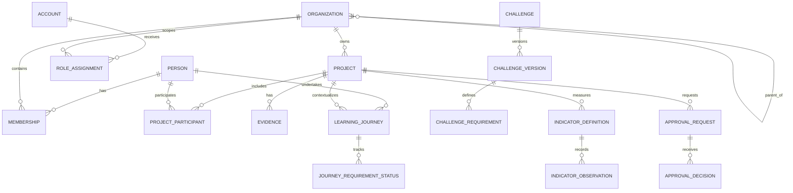

# SCOUTHUB RÉGION — MASTER PRODUCT & SYSTEM SPECIFICATION
## Plateforme numérique régionale du scoutisme — de Projects & Impact vers un Scout Operating System

> **Pivot infrastructure v1.1 :** architecture pilote serverless à coût nul visé — Cloudflare Workers/OpenNext + Neon PostgreSQL + R2 + Clerk + Queues/Cron. NestJS/Fastify retirés du MVP.

**Version : 1.1 — 25 juillet 2026**  
**Nom de travail : ScoutHub Région**  
**Statut : spécification produit et technique de référence — prête pour démarrage Codex**  
**Portée initiale : Région scoute pilote, avec architecture extensible vers une OSN**

> **Vision :** passer d’un scoutisme administré par des fichiers, WhatsApp et ressaisies successives à un scoutisme piloté par des workflows, des données fiables et une mémoire institutionnelle, sans sacrifier la méthode scoute, la protection des jeunes ni l’autonomie des groupes.

---

# 0. Résumé exécutif

ScoutHub Région est une plateforme numérique conçue pour devenir progressivement le **socle opérationnel régional** du scoutisme. Le premier produit livrable n’est pas un ERP complet : c’est un module **Projects & Impact** centré sur la gestion de projets communautaires, Scouts for SDGs, preuves, validations, publication et suivi d’impact. Cette première brique crée les fondations réutilisables — identité, organisations, rôles, documents, audit, notifications, reporting — qui permettront ensuite d’ajouter membres, listes nominatives, assurance, événements, Programme des Jeunes, formations, partenaires et autres processus administratifs.

La plateforme possède trois faces :

1. **Console interne** — espace sécurisé des responsables, groupes, districts et région ;
2. **Portail public** — vitrine des réalisations, statistiques d’impact et opportunités de partenariat ;
3. **Couche d’intégration** — coexistence avec les outils nationaux et mondiaux, notamment SIGERAS, Scouts for SDGs, ScoutPass et les outils OMMS.

## 0.1 Décision stratégique principale

Le projet ne doit pas chercher à remplacer immédiatement les systèmes existants. Le site des Scouts du Sénégal présente déjà **SIGERAS** comme système de gestion administrative destiné à la centralisation des données et au suivi des activités nationales. World Scouting dispose également de ScoutPass, Scouts for SDGs et du NSO Data Portal. ScoutHub doit donc être conçu comme **une couche opérationnelle locale interopérable**, avec possibilité de migration ou d’intégration ultérieure après accord institutionnel.

## 0.2 Wedge product

Le point d’entrée recommandé est :

**Projects & Impact → Scouts for SDGs → registre régional → validation → impact → vitrine publique.**

Pourquoi ? Parce que :
- le problème est concret et immédiat ;
- les workflows sont déjà documentés ;
- les utilisateurs sont identifiables ;
- la région dispose déjà d’un premier cas réel ;
- la valeur est visible sans attendre une base complète de membres ;
- ce module oblige à créer les bons fondements techniques réutilisables.

## 0.3 Anti-objectif

**Ne pas lancer en V1** : comptabilité complète, paiement des cotisations, gestion médicale, dossier Safe from Harm détaillé, messagerie sociale, e-learning complet, microservices, blockchain, moteur de badges propriétaire, application mobile native.

---

# 1. Contexte, opportunité et positionnement

## 1.1 Problème actuel

Dans une organisation distribuée, les informations peuvent être dispersées dans :
- WhatsApp ;
- Google Drive personnel ;
- fichiers Word ;
- feuilles Excel ;
- formulaires papier ;
- téléphones des responsables ;
- e-mails ;
- plateformes mondiales distinctes.

Les conséquences classiques sont :
- ressaisie des mêmes informations ;
- versions contradictoires ;
- absence de statut clair ;
- validation difficile à retracer ;
- perte de mémoire lors des changements de mandat ;
- statistiques approximatives ;
- faible capacité à démontrer l’impact à un partenaire ;
- difficulté pour un nouveau responsable de reprendre les dossiers ;
- risque accru sur les données des mineurs.

## 1.2 Opportunité

ScoutHub peut produire cinq transformations :

### A. Administration par workflow
Un processus possède un statut, un responsable, des échéances et un historique.

### B. Données structurées
Les mêmes données alimentent documents, tableaux de bord, listes, rapports et portail public.

### C. Mémoire institutionnelle
Les données appartiennent à l’organisation, non au téléphone ou au compte personnel d’un responsable.

### D. Pilotage
La région peut répondre rapidement : combien de groupes actifs ? quels projets ? quelles heures de service ? quels dossiers bloqués ? quelles localités touchées ?

### E. Valorisation
Les réalisations validées deviennent visibles sous forme de portfolio public, avec indicateurs crédibles et possibilité d’intéresser des partenaires.

## 1.3 Positionnement par rapport aux outils existants

### SIGERAS — niveau national
Le site des Scouts du Sénégal présente SIGERAS comme un système de gestion administrative pour centraliser les données et suivre les activités nationales. **Conséquence :** avant toute extension ScoutHub vers la gestion nationale des membres, l’équipe doit réaliser un audit fonctionnel de SIGERAS et définir : coexistence, intégration, import/export, extension ou éventuelle convergence.

### Scouts for SDGs — niveau mondial
ScoutHub ne remplace pas la plateforme officielle. Il :
- prépare le parcours ;
- structure les preuves ;
- suit les exigences ;
- génère le dossier de publication ;
- conserve le lien et le statut externe ;
- aide le groupe à suivre les corrections.

### ScoutPass — badges et parcours mondiaux
ScoutPass propose des badges numériques, des parcours éducatifs et des outils de troupe. ScoutHub doit donc éviter de créer un portefeuille mondial concurrent. Il peut suivre localement l’état d’un badge, conserver une référence externe et préparer une future intégration officielle.

### NSO Data Portal / World Scouting Directory
Ces outils servent à l’information institutionnelle et au reporting des OSN. ScoutHub peut à terme produire des agrégats/exportations facilitant le reporting national, sans tenter d’accéder ou d’écrire dans ces systèmes sans API et autorisation officielles.

## 1.4 Principe d’interopérabilité

Toute intégration externe suit quatre niveaux :

1. **Lien/deep-link** — rediriger vers l’outil officiel ;
2. **Export/import** — CSV, XLSX, PDF, JSON si permis ;
3. **Synchronisation assistée** — utilisateur confirme les données à transférer ;
4. **API officielle** — uniquement lorsqu’une API documentée et une autorisation existent.

**Interdit :** scraping d’un espace authentifié, contournement d’API, stockage de mots de passe Scout.org, automatisation non autorisée d’attribution de badges.

---

# 2. Vision produit, principes et métrique North Star

## 2.1 Vision à 3 horizons

### Horizon 1 — Projects & Impact
Créer, valider, documenter, publier et suivre les projets.

### Horizon 2 — Operations
Registre organisationnel, membres, listes nominatives, assurance, documents, événements, formations.

### Horizon 3 — Digital Scout Region
Programme des Jeunes, progression, partenaires, reporting stratégique, intégrations nationales/mondiales, réplication multi-région.

## 2.2 Principes produit

1. **Mobile first, faible bande passante.**
2. **Une donnée saisie une fois, réutilisée partout.**
3. **Le groupe reste propriétaire de son travail ; la région accompagne et contrôle.**
4. **Aucune donnée personnelle n’est publique par défaut.**
5. **Les mineurs n’ont pas besoin d’un compte pour exister dans le système.**
6. **Les permissions dépendent du rôle ET du périmètre organisationnel.**
7. **Tout changement important est auditable.**
8. **Les états métier sont explicites.**
9. **Les intégrations externes sont des adaptateurs remplaçables.**
10. **Le système doit pouvoir fonctionner pour une région sans empêcher un déploiement national.**
11. **Le portail public ne lit jamais directement des données privées non filtrées.**
12. **Les documents générés proviennent des données structurées, pas de doubles saisies.**
13. **L’IA assiste ; elle ne valide pas les décisions institutionnelles.**

## 2.3 North Star Metric

**Nombre de processus régionaux terminés de bout en bout sans ressaisie externe.**

Pour le MVP :
> nombre de projets passés de création → validation → exécution → rapport → publication/valorisation → suivi d’impact dans ScoutHub.

## 2.4 KPIs de lancement

- ≥ 80 % des nouveaux projets pilotes créés dans ScoutHub ;
- ≥ 70 % des dossiers complets sans échange de pièces par WhatsApp ;
- temps médian de validation régionale ;
- % de projets avec au moins un indicateur post-projet ;
- % de dossiers retournés pour pièces manquantes ;
- taux d’utilisateurs actifs mensuels parmi les chefs pilotes ;
- nombre de rapports générés automatiquement ;
- taux d’erreurs dans les statistiques ;
- taux de survie/retenue/impact selon type de projet ;
- zéro exposition publique non autorisée de données de mineurs.

---

# 3. Périmètre fonctionnel global

## 3.1 Modules de plateforme

### Core Platform
- identité et authentification ;
- organisations hiérarchiques ;
- rôles et permissions ;
- audit ;
- notifications ;
- documents et médias ;
- recherche ;
- préférences ;
- internationalisation ;
- feature flags.

### Projects & Impact — MVP
- banque de modèles ;
- création de projet ;
- Scouts for SDGs ;
- ODD ;
- parcours éducatif ;
- preuves ;
- participants ;
- heures de service ;
- indicateurs ;
- validations ;
- rapport ;
- publication ;
- suivi d’impact ;
- portfolio public.

### Membership — phase 2
- personnes ;
- adhésions ;
- unités ;
- responsables ;
- mandats ;
- import ;
- listes nominatives ;
- statistiques.

### Administration — phase 2/3
- assurance ;
- dossiers annuels ;
- documents générés ;
- demandes administratives ;
- échéances.

### Events — phase 3
- événements ;
- inscriptions ;
- quotas ;
- présence ;
- documents ;
- export logistique.

### Youth Programme — phase 3/4
- progression ;
- badges locaux ;
- challenges ;
- compétences ;
- historique ;
- liens ScoutPass.

### Training & Adults in Scouting — phase 4
- qualifications ;
- formations ;
- parcours ;
- habilitations ;
- expirations.

### Partnerships — phase 4
- organisations partenaires ;
- contacts ;
- opportunités ;
- projets ouverts à partenariat ;
- reporting partenaire.

### Finance — phase tardive
- budgets de projet ;
- contributions ;
- justificatifs ;
- export comptable ;
- pas de comptabilité générale avant décision institutionnelle.

## 3.2 Matrice MVP / plus tard

| Fonction | MVP | Phase suivante | Plus tard |
|---|---:|---:|---:|
| Organisations | Oui | Enrichir | Multi-OSN |
| Adultes utilisateurs | Oui | Oui | Oui |
| Mineurs comme fiches minimales | Optionnel | Oui | Oui |
| Projects & Impact | Oui | Oui | Oui |
| Scouts for SDGs | Oui | Oui | Intégration officielle si possible |
| Portail public | Oui, minimal | Oui | Personnalisation avancée |
| Listes nominatives | Non | Oui | Oui |
| Assurance | Non | Oui | Oui |
| Événements | Non | Oui | Oui |
| Programme des Jeunes complet | Non | Partiel | Oui |
| ScoutPass | Lien/statut | Sync si autorisée | API officielle |
| Paiement | Non | Étude | Selon politique |
| Incident safeguarding détaillé | Non | Système séparé | Seulement si gouvernance forte |

---

# 4. Personas et Jobs To Be Done

## 4.1 Visiteur public

**Profil :** parent, ancien scout, citoyen, média.  
**Besoin :** comprendre la région, voir des réalisations crédibles, trouver un contact.  
**Accès :** public uniquement.  
**JTBD :** « Quand je découvre cette région scoute, je veux voir ce qu’elle fait réellement afin de décider si je lui fais confiance ou si je souhaite la rejoindre/soutenir. »

## 4.2 Partenaire / bailleur potentiel

**Profil :** mairie, entreprise, ONG, fondation, service technique.  
**Besoin :** portfolio, chiffres vérifiables, projets ouverts à partenariat, rapport d’impact.  
**Accès :** public + éventuellement espace partenaire sur invitation.  
**JTBD :** « Je veux évaluer rapidement la crédibilité et l’impact de la région avant de financer ou de collaborer. »

## 4.3 Jeune scout

**Profil :** membre participant aux activités et projets.  
**Besoin :** comprendre son parcours, déposer certaines réflexions/preuves si son âge et la politique le permettent.  
**Accès :** aucun compte requis en MVP ; compte optionnel plus tard selon politique nationale, consentement et âge.  
**JTBD :** « Je veux voir ce qu’il me reste à accomplir et conserver la trace de mes réalisations. »

## 4.4 Parent / tuteur

**Profil :** représentant légal d’un mineur.  
**Besoin :** consentements, informations administratives limitées, autorisations futures.  
**Accès :** seulement aux mineurs explicitement liés.  
**JTBD :** « Je veux comprendre quelles données sont utilisées et donner ou retirer les autorisations nécessaires. »

## 4.5 Chef d’unité

**Profil :** responsable pédagogique de proximité.  
**Besoin :** gérer projets, participants, activités, preuves, progression.  
**Périmètre :** son unité.  
**JTBD :** « Je veux conduire un projet conforme sans chercher dix documents différents. »

## 4.6 Chef de projet / référent Scouts for SDGs

**Profil :** responsable désigné d’un projet.  
**Besoin :** construire le dossier, assigner tâches, suivre preuves, répondre aux retours.  
**Périmètre :** projets assignés.  
**JTBD :** « Je veux savoir exactement ce qui manque pour que le projet soit validable et publiable. »

## 4.7 Chef de groupe / administrateur de groupe

**Profil :** responsable local.  
**Besoin :** visibilité sur unités, membres, projets, documents et statistiques du groupe.  
**Périmètre :** groupe et unités descendantes.  
**JTBD :** « Je veux piloter mon groupe sans reconstruire des listes à chaque demande régionale. »

## 4.8 Commissaire de district

**Profil :** encadrement intermédiaire si applicable.  
**Besoin :** suivre les groupes du district, détecter retards et besoins.  
**Périmètre :** district.  
**JTBD :** « Je veux savoir quels groupes ont besoin d’accompagnement et quels dossiers sont bloqués. »

## 4.9 Commissaire régional Programme des Jeunes / reviewer

**Profil :** responsable de cohérence éducative et Scouts for SDGs.  
**Besoin :** file de validation, commentaires, conformité challenge, indicateurs, suivi.  
**Périmètre :** région.  
**JTBD :** « Je veux contrôler la qualité pédagogique et aider les groupes à atteindre une reconnaissance sans traiter les dossiers dans WhatsApp. »

## 4.10 Secrétaire / administrateur régional

**Profil :** administration.  
**Besoin :** organisations, mandats, documents, exports, listes, assurance à terme.  
**Périmètre :** région.  
**JTBD :** « Je veux disposer d’une base propre pour générer les documents administratifs. »

## 4.11 Responsable communication

**Profil :** communication régionale.  
**Besoin :** consulter uniquement les projets autorisés à la communication, sélectionner médias consentis, rédiger publication.  
**Périmètre :** contenu publiable régional.  
**JTBD :** « Je veux valoriser les réalisations sans exposer des données personnelles ou utiliser une photo non autorisée. »

## 4.12 Responsable données / protection des données

**Profil :** personne désignée pour gouvernance des données.  
**Besoin :** inventaire, demandes d’accès/suppression, consentements, rétention, export d’audit.  
**Périmètre :** métadonnées nécessaires, pas accès automatique au contenu de safeguarding hautement confidentiel.  
**JTBD :** « Je veux savoir quelles données existent, pourquoi elles existent et qui y a accédé. »

## 4.13 Responsable Safe from Harm

**Profil :** personne habilitée.  
**Besoin :** vérifier conformité d’une activité et traiter, dans un système séparé ou cloisonné, les signalements sensibles.  
**Périmètre :** strictement minimal.  
**Règle :** le MVP ne stocke pas de dossier détaillé de signalement ; il peut enregistrer uniquement un statut de conformité et un identifiant externe restreint.

## 4.14 Observateur national

**Profil :** responsable national autorisé.  
**Besoin :** consulter les données agrégées, projets, méthodes, exports ; préparer intégration avec SIGERAS.  
**Accès :** lecture ou validation ciblée selon mandat.

## 4.15 Administrateur plateforme

**Profil :** équipe technique.  
**Besoin :** opérer l’application sans disposer d’un accès métier illimité.  
**Règle :** le rôle technique ne doit pas donner automatiquement lecture des données P3/P4. Utiliser accès d’assistance temporaire, journalisé et approuvé.

---

# 5. Modèle d’organisation et de périmètre

## 5.1 Arbre organisationnel

```text
OSN / Association nationale
└── Région
    ├── District
    │   ├── Groupe
    │   │   ├── Unité Louveteaux
    │   │   ├── Unité Éclaireurs
    │   │   └── Unité Routiers
    │   └── Groupe...
    └── Groupe directement rattaché si structure locale différente
```

Le modèle doit permettre de désactiver certains niveaux. Ne pas coder « district obligatoire ».

## 5.2 Organisation générique

Entité `Organization` :
- `id` UUID ;
- `tenant_id` / `nso_id` ;
- `parent_id` nullable ;
- `type` : NSO, REGION, DISTRICT, GROUP, UNIT, TEAM ;
- `name` ;
- `code` ;
- `status` ;
- `path` matérialisé ;
- localisation générique ;
- période d’activité ;
- métadonnées contrôlées.

## 5.3 Principe multi-tenant

Même si le pilote ne concerne qu’une région, toutes les tables métier doivent être rattachables à une racine `tenant_id`. Cela permettra :
- plusieurs régions ;
- un environnement national ;
- des séparations fortes entre OSN si un jour le produit est réutilisé ailleurs.

**Ne pas** créer une base par groupe en V1.

---

# 6. Modèle d’accès : RBAC + scopes + règles contextuelles

## 6.1 Pourquoi RBAC seul ne suffit pas

Un rôle « Chef de groupe » n’a de sens qu’avec un périmètre. Deux chefs de groupe ont les mêmes permissions mais sur des arbres différents. Le système utilise donc :

**Permission + rôle + scope organisationnel + relation à la ressource + classification de donnée.**

## 6.2 Format des permissions

Exemples :
- `project.create`
- `project.read`
- `project.update`
- `project.submit`
- `project.review`
- `project.publish_public`
- `member.read`
- `member.update`
- `document.generate`
- `analytics.read`
- `role.assign`
- `consent.manage`
- `audit.read`

## 6.3 Scopes

- `OWN` — ressources créées/assignées ;
- `UNIT` ;
- `GROUP` ;
- `DISTRICT` ;
- `REGION` ;
- `NATIONAL` ;
- `GLOBAL_TECH` — uniquement métadonnées techniques contrôlées.

## 6.4 Rôles de base

| Rôle | Scope typique | Écriture | Validation | Données personnelles | Publication |
|---|---|---:|---:|---:|---:|
| Public | Public | Non | Non | Non | Non |
| Partner Viewer | Projets partagés | Non | Non | Non | Non |
| Project Contributor | Projet | Oui limitée | Non | Participants minimaux | Non |
| Unit Leader | Unité | Oui | Interne unité | Oui nécessaire | Non |
| Group Admin | Groupe | Oui | Pré-validation | Oui groupe | Soumission |
| District Reviewer | District | Commentaires | Oui si configuré | Limitée | Non |
| Regional Programme Reviewer | Région | Commentaires | Oui | Limitée | Prépare publication |
| Regional Admin | Région | Oui | Administration | Oui selon besoin | Non par défaut |
| Regional Comms | Région | Contenu public | Non | Seulement données approuvées | Oui |
| Data Officer | Région | Gouvernance | Non | Métadonnées/DSR | Non |
| National Observer | Région(s) partagées | Non | Optionnel | Agrégée | Non |
| Platform Admin | Technique | Technique | Non | Pas par défaut | Non |

## 6.5 Règles contextuelles critiques

- Un chef de projet ne peut ajouter un participant d’un autre groupe sans autorisation.
- Un reviewer ne valide pas son propre projet lorsqu’un second niveau de contrôle est activé.
- Une publication publique nécessite `public_visibility = approved`.
- Une photo de mineur nécessite un état de média compatible avec la politique de consentement.
- Une suppression de personne doit respecter rétention légale/institutionnelle et anonymiser ce qui doit rester statistique.
- Un rôle expire automatiquement à la fin d’un mandat si une date de fin existe.
- Un compte suspendu ne conserve aucune session active.

## 6.6 Séparation des devoirs

Pour les opérations sensibles :
- demandeur ≠ approbateur ;
- administrateur plateforme ≠ administrateur métier ;
- communication ≠ propriétaire du consentement ;
- suppression massive ≠ action mono-utilisateur sans confirmation renforcée.

---

# 7. Classification des données

| Niveau | Description | Exemples | Public ? | Cache local ? |
|---|---|---|---:|---:|
| P0 | Public | titre projet, résultats publiés | Oui | Oui |
| P1 | Interne | statut projet, commentaires non sensibles | Non | Oui contrôlé |
| P2 | Personnel | nom adulte, e-mail, fonction | Non | Limité |
| P3 | Mineur/confidentiel | date naissance, contacts, pièces | Non | Non par défaut |
| P4 | Très restreint | safeguarding, informations médicales, secrets, finance sensible | Jamais | Jamais |

**Règle :** chaque champ ou ressource sensible possède une classification et une politique de rétention.

---

# 8. Module MVP — Projects & Impact

## 8.1 Objet

Permettre à un groupe de gérer un projet de service communautaire depuis l’idée jusqu’au suivi d’impact, avec une option Scouts for SDGs/challenge.

## 8.2 Fiche projet

Champs principaux :
- titre ;
- slug interne ;
- organisation porteuse ;
- unité(s) ;
- chef de projet ;
- description courte ;
- problème communautaire ;
- diagnostic ;
- bénéficiaires ;
- localité / coordonnées approximatives ou précises selon politique ;
- dates prévues/réelles ;
- objectifs ;
- résultats attendus ;
- ODD ;
- initiative/challenge ;
- budget résumé ;
- partenaires ;
- risques ;
- plan Safe from Harm ;
- indicateurs ;
- plan de preuve ;
- statut ;
- visibilité ;
- échéances de suivi.

## 8.3 Templates

Un projet peut partir :
- d’un projet vide ;
- d’un template régional ;
- d’un challenge Scouts for SDGs ;
- d’un projet antérieur réutilisable ;
- d’un import.

Exemples de templates :
- reboisement ;
- collecte/tri plastique ;
- dialogue pour la paix ;
- projet innovation ;
- activité solaire ;
- action nutrition ;
- patrimoine.

## 8.4 Challenges Scouts for SDGs

Entités configurables :
- initiative ;
- challenge ;
- version de référentiel ;
- âge recommandé ;
- exigences ;
- activités ;
- type de preuve ;
- règle de complétion ;
- lien officiel ;
- statut actif/archivé.

**Important :** les exigences doivent être versionnées. Un projet lancé selon une version donnée conserve cette version même si le référentiel est mis à jour.

## 8.5 Parcours éducatif

Pour chaque participant ou équipe :
- auto-évaluation si requise ;
- activités choisies ;
- dates ;
- réflexion ;
- preuve ;
- validation du responsable adulte ;
- progression calculée ;
- éléments manquants.

Le système doit pouvoir gérer :
- parcours individuel ;
- activités réalisées en groupe avec validation individuelle ;
- exigences communes au projet ;
- exigences spécifiques au challenge.

## 8.6 Preuves

Types :
- photo ;
- vidéo/lien ;
- document ;
- attestation ;
- liste de présence ;
- mesure ;
- localisation ;
- témoignage ;
- production du jeune ;
- facture/reçu ;
- capture externe.

Métadonnées :
- auteur ;
- date ;
- type ;
- description ;
- classification ;
- consentement média ;
- hash du fichier ;
- taille ;
- projet ;
- exigence liée ;
- validation.

## 8.7 Heures de service

Modes :
- saisie individuelle ;
- saisie en lot ;
- calcul activité × participants ;
- import depuis présence.

Le calcul doit garder la **formule et la source**, pas seulement le total.

Exemple :
`32 participants × 4 h = 128 heures de service`.

Un reviewer peut corriger ou demander justification.

## 8.8 Indicateurs

Chaque indicateur possède :
- définition ;
- unité ;
- baseline ;
- cible ;
- source de mesure ;
- fréquence ;
- responsable ;
- observations temporelles.

Exemple reboisement :
- `trees_planted = 350` ;
- `trees_alive_6m = 294` ;
- `survival_rate_6m = 84%`.

## 8.9 Rapport automatique

Le système génère un rapport DOCX/PDF depuis les données :
- résumé ;
- contexte ;
- objectifs ;
- activités ;
- participants agrégés ;
- résultats ;
- indicateurs ;
- dépenses résumées ;
- difficultés ;
- apprentissages ;
- photos approuvées ;
- suivi ;
- annexes.

Le rapport doit garder une **version snapshot** : un rapport validé ne change pas silencieusement si les données du projet évoluent.

## 8.10 Publication publique

Un projet peut être :
- privé ;
- interne ;
- partage par lien ;
- public après validation.

La page publique n’utilise qu’un `PublicProjectView` dénormalisé/filtré :
- pas de noms de mineurs ;
- pas de contacts ;
- pas de pièces internes ;
- pas de coordonnées sensibles ;
- médias approuvés uniquement ;
- chiffres validés.

## 8.11 Publication Scouts for SDGs

ScoutHub prépare :
- titre ;
- résumé ;
- récit ;
- dates ;
- ODD ;
- heures ;
- photos conformes ;
- données du challenge ;
- checklist de soumission.

Statuts externes :
- `NOT_READY` ;
- `READY_TO_SUBMIT` ;
- `SUBMITTED_EXTERNALLY` ;
- `CHANGES_REQUESTED` ;
- `APPROVED_EXTERNALLY` ;
- `ARCHIVED_EXTERNALLY`.

Le lien de publication et la date sont enregistrés manuellement en MVP.

## 8.12 Badge tracking

Entité `RecognitionRecord` :
- challenge ;
- participant ;
- statut local ;
- preuve d’accomplissement ;
- badge numérique externe : inconnu / demandé / obtenu ;
- badge physique : non applicable / à confirmer / demandé / attribué ;
- URL ScoutPass éventuelle ;
- validateur local ;
- date.

**Le système ne “décerne” pas un badge OMMS.** Il suit la reconnaissance et peut gérer un badge régional uniquement si une politique officielle le prévoit.

---

# 9. Workflows détaillés

# 9.1 Flow A — Onboarding d’un responsable adulte

```text
Invitation par un admin autorisé
→ e-mail / lien à usage unique
→ création ou liaison de compte
→ vérification e-mail
→ MFA recommandé / obligatoire selon rôle
→ acceptation conditions & politique données
→ association à Person
→ rôle + scope + dates de mandat
→ tableau de bord correspondant
```

### Règles
- aucune auto-inscription donnant un rôle d’administration ;
- un rôle élevé nécessite invitation ;
- les invitations expirent ;
- un changement de fonction crée un nouvel `RoleAssignment`, il ne réécrit pas l’historique ;
- fin de mandat → permissions expirées automatiquement.

### Critères d’acceptation
- un invité ne peut rejoindre qu’une organisation autorisée ;
- le token ne fonctionne qu’une fois ;
- le journal conserve l’inviteur, la date et le rôle accordé ;
- les sessions anciennes sont invalidées lors d’une suspension.

# 9.2 Flow B — Création d’un groupe/unité

```text
Regional Admin
→ crée organisation
→ choisit type et parent
→ code unique
→ nomme responsable
→ renseigne métadonnées minimales
→ statut DRAFT
→ validation administrative
→ ACTIVE
```

Le modèle permet l’import depuis SIGERAS ou un fichier contrôlé.

# 9.3 Flow C — Nouveau projet standard

```text
Chef / Project Manager
→ Nouveau projet
→ choisir organisation et template
→ titre + problème + localité
→ choisir ODD / challenge éventuel
→ système charge checklist
→ compléter diagnostic
→ objectifs + indicateurs + plan de preuves
→ participants / partenaires
→ risques + SfH
→ auto-contrôle
→ SUBMIT_FOR_REVIEW
→ reviewer régional
   ├─ REQUEST_CHANGES → retour avec commentaires
   └─ APPROVE → READY_FOR_EXECUTION
→ exécution + preuves + heures
→ PROJECT_COMPLETED
→ rapport + réflexion + indicateurs
→ SUBMIT_FINAL_REVIEW
→ reviewer
   ├─ REQUEST_CHANGES
   └─ APPROVE_FINAL
→ préparer publication externe / publique
→ suivi post-projet
→ CLOSED
```

# 9.4 Flow D — Projet déjà réalisé

```text
Créer projet → mode ALREADY_COMPLETED
→ saisir faits historiques
→ preuves existantes
→ audit de correspondance challenge
→ système classe exigences : PROUVÉ / À COMPLÉTER / NON APPLICABLE
→ projet peut être publiable même si challenge incomplet
→ si badge visé : compléter activités / phase 2
→ évaluation
→ publication / reconnaissance
```

Le système doit empêcher de marquer une exigence « réalisée » sans date et justification.

# 9.5 Flow E — Validation régionale

Reviewer voit une file :
- dossiers nouveaux ;
- dossiers retournés ;
- délais ;
- risque ;
- challenge ;
- groupe.

Actions :
- commenter un champ ;
- commenter globalement ;
- demander pièce ;
- marquer un critère ;
- approuver ;
- rejeter avec motif ;
- transférer à un second reviewer.

Chaque décision crée un `ApprovalDecision` immuable.

# 9.6 Flow F — Evidence upload faible bande passante

```text
Utilisateur sélectionne photo
→ compression côté client si image
→ suppression EXIF sensible par défaut
→ affichage taille
→ upload multipart/résumable
→ antivirus / validation MIME côté serveur
→ hash
→ stockage objet privé
→ miniature
→ choix : preuve interne / média candidat public
→ si public : workflow consentement/communication
```

Offline : permettre de préparer un brouillon et une file d’upload, mais **ne pas conserver P3/P4 durablement hors ligne**.

# 9.7 Flow G — Suivi reboisement

```text
Projet validé
→ système crée échéances J+30 / M3 / M6 / M12
→ notification responsable
→ formulaire observation
→ vivants / morts / remplacés
→ photos
→ calcul taux de survie
→ graphe temporel
→ si taux sous seuil : alerte / action corrective
→ mise à jour page publique après validation
```

# 9.8 Flow H — Publication publique

```text
Projet final validé
→ communication reçoit "Ready for public review"
→ sélection médias approuvés
→ résumé public généré/proposé
→ vérification données sensibles
→ Preview
→ Publish
→ page versionnée
```

Un retrait de consentement média doit permettre de retirer le média du public sans effacer nécessairement la preuve interne si la politique de conservation l’autorise.

# 9.9 Flow I — Soumission Scouts for SDGs

```text
Projet final validé
→ checklist externe
→ générer paquet de soumission
→ ouvrir sdgs.scout.org
→ utilisateur soumet manuellement
→ saisir URL/date/statut dans ScoutHub
→ si corrections : créer tâche
→ resoumettre
→ approuvé : enregistrer lien
→ déclencher suivi reconnaissance
```

# 9.10 Flow J — Import initial de membres (phase 2)

```text
Admin choisit source : SIGERAS export / CSV standard
→ upload
→ mapping colonnes
→ validation format
→ détection doublons
→ preview
→ erreurs à corriger
→ import transactionnel
→ rapport d’import
→ audit
```

Aucune importation de masse ne doit s’exécuter sans preview et possibilité de rollback logique.

# 9.11 Flow K — Liste nominative (phase 2)

```text
Chef groupe
→ Documents
→ Liste nominative
→ période / unité / statut membre
→ preview
→ données manquantes signalées
→ générer PDF/XLSX/DOCX
→ numéro de document + date
→ snapshot archivé
```

# 9.12 Flow L — Assurance (phase 2)

```text
Chef groupe
→ nouvelle campagne/demande assurance
→ sélectionner membres éligibles
→ validation complétude
→ pièces requises
→ soumettre
→ régional : conforme / retour
→ transmis au niveau compétent
→ assurer / rejet / correction
→ statut individuel + collectif
→ export liste
```

Le module doit rester adaptable aux règles réelles de l’assureur et de l’OSN.

# 9.13 Flow M — Événement (phase 3)

```text
Créer événement
→ capacité / branches / quotas
→ ouvrir inscriptions
→ groupe sélectionne membres existants
→ vérifications
→ inscription
→ validation
→ check-in / présence
→ statistiques
→ attestations / rapport
```

Objectif : ne jamais ressaisir identité et groupe d’un membre déjà enregistré.

# 9.14 Flow N — Partenaire

```text
Visiteur voit projet ouvert
→ "Proposer un partenariat"
→ formulaire public minimal
→ anti-spam
→ création Lead
→ regional partnerships reviewer
→ qualification
→ échange hors plateforme ou espace invité
→ rattachement au projet
→ historique contribution
```

Ne pas publier le budget détaillé ou les contacts internes par défaut.

# 9.15 Flow O — Demande d’accès aux données / correction / suppression

```text
Demande reçue
→ vérifier identité du demandeur
→ classifier demande
→ geler destruction automatique si nécessaire
→ rechercher données concernées
→ exporter/corriger/anonymiser selon politique
→ approbation Data Officer
→ réponse
→ audit
```

# 9.16 Flow P — Offboarding d’un responsable

```text
Fin de mandat / départ
→ désactiver RoleAssignment
→ réassigner dossiers ouverts
→ retirer groupes de notification
→ révoquer sessions
→ conserver historique d’actions
→ compte personnel peut rester avec accès minimal si politique le permet
```

---

# 10. Machines à états

## 10.1 Projet

```text
DRAFT
→ READY_FOR_REVIEW
→ IN_REVIEW
→ CHANGES_REQUESTED ↔ READY_FOR_REVIEW
→ APPROVED_FOR_EXECUTION
→ IN_EXECUTION
→ EXECUTION_COMPLETED
→ FINAL_REVIEW
→ FINAL_CHANGES_REQUESTED ↔ FINAL_REVIEW
→ VALIDATED
→ READY_FOR_PUBLICATION
→ PUBLISHED / EXTERNAL_SUBMITTED
→ MONITORING
→ CLOSED

Branches : CANCELLED, REJECTED, ARCHIVED
```

Transitions contrôlées par permission. Pas de modification directe du `status` depuis un formulaire générique.

## 10.2 Projet public

`PRIVATE → INTERNAL → REVIEW_PUBLIC → PUBLIC → UNPUBLISHED → ARCHIVED`

## 10.3 Approbation

`PENDING → APPROVED | CHANGES_REQUESTED | REJECTED | CANCELLED`

## 10.4 Assurance

`DRAFT → SUBMITTED → NEEDS_CORRECTION → VERIFIED → TRANSMITTED → INSURED | REJECTED | EXPIRED`

## 10.5 Compte

`INVITED → ACTIVE → SUSPENDED → DISABLED → ANONYMIZED`.

---

# 11. Architecture de l’information et écrans

## 11.1 Applications

### `portal` — public
Routes indicatives :
- `/`
- `/impact`
- `/projects`
- `/projects/[slug]`
- `/partners`
- `/about`
- `/contact`

### `console` — interne
- `/dashboard`
- `/projects`
- `/projects/new`
- `/projects/[id]/overview`
- `/projects/[id]/plan`
- `/projects/[id]/challenge`
- `/projects/[id]/participants`
- `/projects/[id]/evidence`
- `/projects/[id]/indicators`
- `/projects/[id]/reviews`
- `/projects/[id]/report`
- `/projects/[id]/publication`
- `/projects/[id]/monitoring`
- `/reviews`
- `/organizations`
- `/members` (phase 2)
- `/documents`
- `/analytics`
- `/settings`
- `/admin/roles`
- `/admin/audit`

## 11.2 Dashboard chef de groupe

Widgets :
- projets ouverts ;
- tâches à faire ;
- validations retournées ;
- échéances impact ;
- heures de service ;
- documents récents ;
- plus tard membres / assurance / événements.

## 11.3 Dashboard régional

- projets par statut ;
- file de validation ;
- groupes actifs/inactifs ;
- heures de service ;
- ODD ;
- carte des projets ;
- indicateurs d’impact ;
- dossiers en retard ;
- qualité des données ;
- tendances temporelles.

## 11.4 UX project wizard

Le wizard ne doit pas être un formulaire de 60 champs. Découper :
1. identité du projet ;
2. besoin ;
3. challenge/ODD ;
4. objectifs ;
5. équipe ;
6. plan ;
7. risques ;
8. indicateurs ;
9. résumé et soumission.

Autosave à chaque étape.

## 11.5 États UI obligatoires

Chaque écran doit prévoir :
- loading ;
- empty ;
- partial data ;
- forbidden ;
- offline ;
- error ;
- success ;
- stale data ;
- conflict concurrent edit.

---

# 12. Notifications et tâches

## 12.1 Canaux

MVP :
- notification in-app ;
- e-mail.

Plus tard :
- WhatsApp Business API officiel si gouvernance/consentement ;
- SMS pour messages critiques ;
- push PWA.

## 12.2 Événements de notification

- invitation ;
- projet soumis ;
- changement demandé ;
- validation ;
- commentaire mentionnant utilisateur ;
- échéance proche ;
- suivi impact dû ;
- assurance à corriger ;
- rôle expirant ;
- document prêt.

## 12.3 Préférences

Ne pas permettre de désactiver les notifications critiques de sécurité/compte. Regrouper les notifications non urgentes en digest pour limiter le bruit.

---

# 13. Recherche, filtres et registre

## 13.1 Recherche globale

Recherche par :
- nom projet ;
- code ;
- groupe ;
- localité ;
- challenge ;
- ODD ;
- partenaire ;
- responsable.

Les résultats respectent toujours le scope d’autorisation.

## 13.2 Registre projets

Colonnes configurables :
- code ;
- titre ;
- groupe ;
- challenge ;
- statut ;
- responsable ;
- dates ;
- heures ;
- publication ;
- prochaine échéance ;
- qualité dossier.

Exports : CSV/XLSX/PDF selon permissions.

---

# 14. Modèle de données conceptuel

## 14.1 Principes

- UUID pour identifiants externes ;
- `created_at`, `updated_at`, `created_by` lorsque pertinent ;
- soft-delete seulement quand nécessaire ;
- audit séparé et append-only ;
- dates en UTC, affichage timezone locale ;
- champs sensibles minimisés ;
- tables de référence versionnées ;
- index selon requêtes réelles ;
- contraintes SQL, pas uniquement validation frontend.

## 14.2 Identité et personnes

### `account`
Identité d’authentification.
- id ;
- provider_subject ;
- email ;
- email_verified_at ;
- status ;
- last_login_at.

### `person`
Personne métier, avec ou sans compte.
- id ;
- tenant_id ;
- first_name ;
- last_name ;
- display_name ;
- birth_date nullable ;
- gender si nécessaire/statutaire et légalement justifié ;
- contact minimal ;
- classification ;
- status.

### `account_person_link`
Permet de séparer authentification et dossier membre.

### `guardian_relation`
- minor_person_id ;
- guardian_person_id ;
- relation_type ;
- verified_at ;
- validity.

## 14.3 Organisation

### `organization`
Hiérarchie générique.

### `membership`
- person_id ;
- organization_id ;
- membership_type ;
- start/end ;
- status ;
- source ;
- external_id.

### `appointment`
Fonction/m mandat.
- person_id ;
- organization_id ;
- position_code ;
- start/end ;
- status.

### `role_assignment`
Permissions applicatives.
- account_id ;
- role_id ;
- scope_org_id ;
- start/end ;
- granted_by.

## 14.4 Référentiels Programme / SDGs

### `initiative`
### `challenge`
### `challenge_version`
### `challenge_requirement`
### `learning_activity_template`
### `sdg_goal`

Ne pas hardcoder les 10 challenges dans des enums applicatives immuables. Les stocker comme configuration versionnée.

## 14.5 Projets

### `project`
- id ;
- tenant_id ;
- owner_org_id ;
- code ;
- title ;
- summary ;
- problem_statement ;
- project_mode : PLANNED / ALREADY_COMPLETED ;
- status ;
- visibility ;
- start/end planned/actual ;
- location ;
- project_lead_person_id ;
- challenge_version_id nullable ;
- public_slug nullable.

### `project_objective`
### `project_activity`
### `project_participant`
### `project_partner`
### `project_sdg`
### `project_risk`
### `project_task`
### `project_comment`

## 14.6 Parcours éducatif

### `learning_journey`
Un participant + challenge + projet ou parcours indépendant.

### `journey_requirement_status`
- requirement_id ;
- status : TODO / IN_PROGRESS / EVIDENCED / VALIDATED / WAIVED ;
- evidence_summary ;
- validated_by.

### `journey_activity`
### `reflection`
### `adult_evaluation`

## 14.7 Preuves et fichiers

### `media_asset`
- object_key ;
- mime ;
- bytes ;
- sha256 ;
- classification ;
- scan_status ;
- width/height ;
- uploaded_by.

### `evidence`
- project_id ;
- media_asset_id nullable ;
- type ;
- title ;
- description ;
- occurred_at ;
- requirement_id nullable ;
- visibility ;
- validation_status.

### `media_consent_status`
Liaison média-personne lorsque nécessaire.

## 14.8 Impact

### `indicator_definition`
- project_id ;
- key ;
- label ;
- unit ;
- baseline ;
- target ;
- methodology.

### `indicator_observation`
- indicator_id ;
- observed_at ;
- value_numeric / value_text ;
- source ;
- evidence_id ;
- validation_status.

### `service_hour_entry`
- project_id ;
- person_id nullable ;
- activity_id ;
- date ;
- minutes ;
- calculation_method ;
- source.

## 14.9 Workflow et approbations

### `approval_request`
- resource_type ;
- resource_id ;
- workflow ;
- stage ;
- requested_by ;
- requested_at.

### `approval_decision`
Append-only.
- request_id ;
- reviewer ;
- decision ;
- reason ;
- decided_at.

### `state_transition`
- entity ;
- from ;
- to ;
- actor ;
- reason ;
- timestamp.

## 14.10 Rapports/publication

### `report_snapshot`
- project_id ;
- version ;
- generated_at ;
- data_snapshot JSONB ;
- file_asset_id.

### `external_publication`
- platform ;
- external_url ;
- status ;
- submitted_at ;
- approved_at ;
- notes.

### `public_project_snapshot`
Vue ou table projetée vers le portail public.

### `recognition_record`
Suivi badge/reconnaissance.

## 14.11 Administration future

### `insurance_campaign`
### `insurance_request`
### `insurance_member_status`
### `event`
### `event_registration`
### `training`
### `qualification`
### `document_template`
### `generated_document`
### `partner_organization`
### `partnership_lead`

## 14.12 Gouvernance

### `consent_record`
- subject_person_id ;
- guardian_person_id nullable ;
- purpose ;
- status ;
- captured_at ;
- expires_at ;
- evidence.

### `data_subject_request`
### `audit_event`
### `access_support_session`
### `integration_mapping`
### `sync_run`

---

# 15. Relations essentielles — ERD simplifié



---

# 16. Architecture technique recommandée

## 16.1 Choix architectural

**Monolithe modulaire, serverless, portable et cost-aware.**

Pour le pilote, ScoutHub est livré comme **un seul déployable Next.js sur Cloudflare Workers**. La séparation public/interne est logique et stricte dans le code, les routes, les policies et les données exposées. Les vues publiques ne lisent jamais directement les enregistrements privés : elles reposent sur des `public_project_snapshot` explicitement publiables.

Pourquoi :
- coût initial visé : **$0/mois** hors nom de domaine éventuel ;
- aucun serveur Node permanent à administrer ;
- déploiement simple ;
- faible charge opérationnelle pour une région bénévole ;
- bonne adaptation aux usages irréguliers ;
- maintien de PostgreSQL pour la richesse relationnelle ;
- frontières de domaine propres permettant une extraction future ;
- migration possible vers une infrastructure payante/VPS/cloud sans réécrire le métier.

Contre-exemples :
- `NestJS + Fastify` sur un VPS gratuit instable oblige à exploiter un serveur permanent ;
- microservices + Kafka + Kubernetes multiplient les coûts et points de panne ;
- dépendre directement des APIs propriétaires Cloudflare/Clerk dans le domaine crée un verrouillage inutile.

**Règle :** l’architecture doit rester *serverless-compatible* mais le domaine doit rester *vendor-neutral*.

## 16.2 Stack de référence au bootstrap

Référence au **25 juillet 2026** ; toujours utiliser une version patchée et supportée au moment du bootstrap.

- **Runtime de build/dev : Node.js 24 LTS** ;
- **Framework full-stack : Next.js 16.x Active LTS** ;
- **Déploiement : Cloudflare Workers via l’adaptateur OpenNext** ;
- **Langage : TypeScript strict** ;
- **Base transactionnelle : Neon PostgreSQL** ;
- **ORM / SQL : Drizzle ORM + migrations SQL explicites** ;
- **Driver edge/serverless : Neon serverless driver** derrière un adapter de persistence ;
- **Validation : Zod** ;
- **Stockage objets : Cloudflare R2** derrière `ObjectStorage` ;
- **Identité : Clerk** derrière `IdentityProvider` ;
- **Autorisations : ScoutHub DB + policy engine interne** ; ne pas utiliser Clerk Organizations comme source de vérité métier ;
- **Asynchrone : Cloudflare Queues** pour les travaux différés ;
- **Planification : Cloudflare Cron Triggers** ;
- **Fiabilité des événements : transactional outbox PostgreSQL** lorsque l’opération exige une livraison garantie ;
- **Observabilité : Workers Logs/Traces + logs structurés** ; adapter OTel externe plus tard si besoin ;
- **Tests E2E : Playwright** ;
- **Tests unitaires/intégration : Vitest** ;
- **Monorepo : pnpm workspaces + Turborepo** ;
- **Développement local DB : PostgreSQL Docker** ;
- **Cloudflare local : Wrangler** ;
- **CI/CD : GitHub Actions + Wrangler**.

### Free-tier target vérifié au 25 juillet 2026

Ces chiffres sont **des limites fournisseur, pas des garanties contractuelles permanentes** :

- Cloudflare Workers Free : jusqu’à **100 000 requêtes/jour**, CPU Free limité ; passage Workers Paid à partir de **$5/mois** si nécessaire ;
- Cloudflare R2 : **10 GB-month** gratuits, 1M opérations Class A et 10M Class B/mois, egress Internet gratuit ;
- Cloudflare Queues Free : **10 000 opérations/jour**, rétention de message 24 h ;
- Neon Free : **0,5 GB par projet**, 50 CU-hours/mois/projet, 5 GB egress/mois ;
- Clerk Hobby : jusqu’à **50 000 Monthly Retained Users/app**.

**Important :** ScoutHub n’utilise pas Clerk Organizations pour représenter Région/District/Groupe/Unité ; les limites B2B Clerk ne doivent donc pas structurer le modèle scout.

## 16.3 Structure repository

```text
scouthub/
├── apps/
│   └── web/                       # Next.js : public + console + API
│       ├── app/
│       │   ├── (public)/          # pages publiques, jamais de données PII brutes
│       │   ├── (console)/app/     # espace authentifié
│       │   └── api/v1/            # Route Handlers REST
│       ├── worker/                # queue consumers / scheduled entrypoints si requis
│       └── wrangler.jsonc         # configuration Cloudflare active
├── packages/
│   ├── domain/                    # entités, value objects, règles métier
│   ├── application/               # use-cases et ports
│   ├── infrastructure/
│   │   ├── database-neon/
│   │   ├── storage-r2/
│   │   ├── identity-clerk/
│   │   ├── queue-cloudflare/
│   │   └── notifications/
│   ├── authz/                     # policies RBAC + scope + contexte
│   ├── contracts/                 # Zod schemas, API contracts
│   ├── ui/
│   ├── config/
│   ├── observability/
│   └── test-utils/
├── database/
│   ├── schema/
│   ├── migrations/
│   └── seeds/
├── docs/
│   ├── MASTER_SPEC.md
│   ├── adr/
│   ├── security/
│   ├── api/
│   └── runbooks/
├── infra/
│   ├── cloudflare/
│   └── local/
├── AGENTS.md
├── docker-compose.yml              # PostgreSQL local uniquement
├── pnpm-workspace.yaml
└── turbo.json
```

## 16.4 Modules métier

```text
domain
├── identity
├── authorization
├── organizations
├── people
├── projects
├── programme
├── evidence
├── approvals
├── impact
├── documents
├── publications
├── analytics
├── notifications
├── integrations
├── audit
└── administration (future)
```

Chaque module doit séparer :
- `domain` ;
- `application/use-cases` ;
- ports/interfaces ;
- infrastructure/adapters ;
- presentation/HTTP ;
- tests.

### Règles de dépendance

- `domain` ne dépend jamais de Next.js, Cloudflare, Clerk, Neon ou R2 ;
- `application` dépend de ports, pas des SDK fournisseurs ;
- les Route Handlers appellent les use-cases ;
- les adapters implémentent les ports ;
- les tables d’un module ne sont pas manipulées directement par l’UI ;
- éviter les imports directs entre modules lorsque le contrat métier suffit.

## 16.5 Diagramme conteneurs — pilote zéro coût

```text
                         INTERNET
                            │
                    Cloudflare CDN/TLS
                            │
                            ▼
                 [Next.js on Workers]
                ┌───────────┼───────────┐
                │           │           │
             Public       Console     /api/v1
                │           │           │
                └───────────┴───────────┘
                            │
                   Application / Domain
           ┌────────────────┼────────────────┐
           ▼                ▼                ▼
       [Clerk]        [Neon PostgreSQL]   [Cloudflare R2]
      Identity          métier/audit       preuves/docs
                            │
                            ▼
                  [Transactional Outbox]
                            │
             ┌──────────────┴──────────────┐
             ▼                             ▼
     [Cloudflare Queues]             [Cron Triggers]
             │
             ▼
      jobs / notifications /
      image processing léger /
      follow-up reminders

CI/CD: GitHub Actions → Wrangler → Cloudflare
Backup: scheduled GitHub Action → pg_dump chiffré → R2
```

## 16.6 Séparation portail public / console interne

En V1, ils partagent le même déployable afin de réduire le coût et la complexité, mais **pas les mêmes frontières de données**.

Règles obligatoires :
- routes publiques sous groupe `(public)` ;
- console sous `/app/*` et groupe `(console)` ;
- API privée exige authentification + policy server-side ;
- le portail lit uniquement des projections/snapshots explicitement publics ;
- aucun `person`, `membership`, contact, consentement ou donnée P3/P4 ne doit être chargé par une route publique ;
- composants UI publics et internes rangés séparément ;
- CSP, cache et headers adaptés par route ;
- tests automatiques vérifiant qu’aucune donnée privée n’apparaît dans les payloads publics.

### Critère d’extraction future

Séparer `portal` et `console` en deux Workers uniquement si :
- les politiques de déploiement divergent ;
- la charge publique devient significative ;
- un audit de sécurité l’exige ;
- les équipes deviennent distinctes.

Cette extraction ne doit pas modifier le domaine.

## 16.7 API

Style recommandé : REST JSON versionné (`/api/v1`) via **Next.js Route Handlers**.

Éviter GraphQL au départ.

Principes :
- contrats Zod partagés ;
- OpenAPI généré à partir des contrats ou maintenu automatiquement ;
- pagination cursor pour grandes listes ;
- idempotency key pour actions sensibles ;
- ETags/version de ressource pour conflits ;
- erreurs structurées RFC 9457-style ;
- `request_id` partout ;
- validation serveur stricte ;
- aucune règle métier dans les composants React ;
- aucune autorisation uniquement côté UI.

Exemples :

```text
POST   /api/v1/projects
GET    /api/v1/projects/:id
PATCH  /api/v1/projects/:id
POST   /api/v1/projects/:id/submit
POST   /api/v1/projects/:id/approve
POST   /api/v1/projects/:id/request-changes
POST   /api/v1/projects/:id/evidence/upload-url
GET    /api/v1/projects/:id/report
POST   /api/v1/projects/:id/publication-snapshot
GET    /api/v1/reviews?status=pending
```

## 16.8 Asynchrone et domain events

Ne pas utiliser `pg-boss` en V1 : un Worker n’est pas un serveur Node permanent.

### Pattern recommandé

1. une transaction métier écrit les données ;
2. si un événement fiable est nécessaire, elle écrit aussi un `outbox_event` ;
3. un Cron Trigger léger récupère les événements non dispatchés ;
4. il les pousse vers Cloudflare Queues ;
5. le consumer exécute l’action ;
6. le traitement est idempotent ;
7. l’outbox conserve l’état de dispatch.

Pour les actions non critiques et immédiatement disponibles, un enqueue direct peut être utilisé si l’échec est sans conséquence métier.

Événements :
- `ProjectSubmitted`
- `ProjectApproved`
- `EvidenceUploaded`
- `FollowUpDue`
- `PublicProjectPublished`

Cas d’usage Queues :
- notifications ;
- compression/normalisation légère après upload ;
- génération asynchrone de rapports ;
- calculs agrégés ;
- suivi d’impact ;
- synchronisations externes futures.

Cas d’usage Cron :
- dispatch outbox ;
- rappels de suivi ;
- agrégats publics ;
- tâches de housekeeping.

## 16.9 Adapters de portabilité obligatoires

```ts
interface IdentityProvider {
  getSession(...): Promise<IdentitySession | null>
  revokeSession(...): Promise<void>
}

interface ProjectRepository {
  findById(...)
  save(...)
}

interface ObjectStorage {
  createUploadUrl(...)
  getDownloadUrl(...)
  deleteObject(...)
}

interface AsyncQueue {
  enqueue(...)
}

interface NotificationGateway {
  send(...)
}
```

**Interdit :** importer directement Clerk/R2/Neon dans les règles métier.

## 16.10 Budget d’infrastructure et seuils de bascule

### Mode pilote — cible $0/mois
- Workers Free ;
- Neon Free ;
- R2 Free ;
- Clerk Hobby ;
- Queues Free ;
- GitHub Actions dans les quotas disponibles.

### Premier upgrade recommandé
Passer Workers Paid (~$5/mois au tarif actuel) avant de bricoler l’architecture si :
- limite CPU Free atteinte ;
- 100k requêtes/jour approchées ;
- besoin de davantage de Cron/Queues/observabilité ;
- usage réel et institutionnel justifie une meilleure marge opérationnelle.

### Upgrade base
Passer Neon sur un plan usage-based lorsque :
- stockage approche 0,5 GB sur le projet de production ;
- compute Free devient un facteur de latence/disponibilité ;
- besoins PITR/monitoring dépassent le Free.

### Upgrade stockage
R2 est facturé à l’usage au-delà du Free tier. Avant achat :
- compression images ;
- lifecycle ;
- suppression des doublons ;
- politique de rétention.

### Règle Cost Guardrail
**Aucun service payant, add-on premium ou ressource persistante ne doit être activé automatiquement par Codex.** Toute dépense récurrente nécessite une décision explicite du Product Owner et un ADR si elle modifie l’architecture.

# 17. Authentification et identité

## 17.1 Architecture

Créer une interface `IdentityProvider`. Le domaine ScoutHub ne connaît pas le SDK Clerk.

### Option recommandée pilote : Clerk

Clerk est utilisé pour :
- inscription/invitation des adultes ;
- login/logout ;
- e-mail vérifié ;
- récupération de compte ;
- gestion de session ;
- MFA/passkeys selon disponibilité du plan et besoin.

Clerk **ne doit pas** devenir la source de vérité pour :
- Région ;
- District ;
- Groupe ;
- Unité ;
- rôle scout ;
- mandat ;
- scope organisationnel ;
- permissions métier.

Ces informations restent dans PostgreSQL et sont évaluées par le policy engine ScoutHub.

### Pourquoi ne pas utiliser Clerk Organizations comme modèle scout ?

Les frontières organisationnelles scouts ont une sémantique propre, évoluent avec les mandats et doivent rester portables. Les plans Clerk ont aussi des limites propres aux fonctions B2B. ScoutHub ne doit pas hériter de ces contraintes pour son modèle métier.

### Alternative future
Si une décision nationale impose une maîtrise IAM complète, l’adapter `IdentityProvider` permet de migrer vers ZITADEL, Keycloak, Auth0, Better Auth ou un fournisseur institutionnel sans modifier les use-cases.

## 17.2 Posture initiale mineurs

**MVP : comptes applicatifs adultes uniquement.**

Les jeunes existent comme `person`/participants sans compte.

Conséquences positives :
- moins de données d’authentification de mineurs ;
- moins de consentements complexes ;
- moins de comptes inutilisés ;
- surface d’attaque réduite ;
- coût d’identité réduit.

Une expérience youth-facing exige une décision produit, juridique et Safe from Harm distincte.

## 17.3 MFA

MFA fortement recommandé/obligatoire selon politique pour :
- Regional Admin ;
- Data Officer ;
- Platform Admin ;
- reviewer à scope régional/national ;
- tout rôle pouvant exporter massivement ou modifier les permissions.

Ne pas rendre la production dépendante d’une fonction premium non confirmée : prévoir une policy qui peut refuser certains rôles si le niveau d’assurance d’authentification requis n’est pas satisfait.

## 17.4 Sessions

- cookies/session fournis par l’IdentityProvider avec protections adaptées ;
- session vérifiée côté serveur ;
- révocation ;
- liste de sessions si disponible ;
- timeout/re-authentication pour actions sensibles ;
- aucune donnée d’autorisation métier durable stockée uniquement dans un token Clerk ;
- les permissions sont recalculées ou récupérées depuis ScoutHub.

## 17.5 Provisioning Account ↔ Person

À la première invitation validée :
1. Clerk crée/identifie l’identité ;
2. ScoutHub crée `account` avec `external_identity_id` opaque ;
3. ScoutHub lie `account` à `person` si autorisé ;
4. ScoutHub attribue les `role_assignment` dans son propre modèle ;
5. audit event créé.

Ne jamais utiliser l’e-mail comme clé métier permanente.

# 18. Autorisation — moteur de policy

## 18.1 Fonction conceptuelle

```ts
can(actor, action, resource, context): Decision
```

La décision examine :
- permissions rôle ;
- organisation scope ;
- relation ;
- statut ressource ;
- classification ;
- ownership ;
- séparation de devoirs ;
- feature flag.

## 18.2 Exemple

Un `GroupAdmin` avec scope Groupe A peut lire un projet appartenant à une unité enfant du Groupe A, mais pas du Groupe B.

Un `RegionalComms` peut lire `PublicProjectDraft`, mais pas la date de naissance des participants.

## 18.3 Enforcement

- backend obligatoire ;
- frontend cache seulement pour UX ;
- tests automatisés matrice rôle × action × scope ;
- éventuellement PostgreSQL RLS comme défense en profondeur sur tables P3 après stabilisation.

---

# 19. Sécurité applicative

## 19.1 Baseline

Le programme sécurité suit au minimum :
- OWASP Top 10:2025 ;
- principes OWASP ASVS adaptés ;
- NIST SP 800-63B-4 pour authentification comme référence technique ;
- revue dépendances ;
- secret management ;
- secure headers ;
- CSP ;
- contrôle upload ;
- audit.

## 19.2 Menaces prioritaires

1. Broken Access Control — principal risque d’une hiérarchie régionale ;
2. mauvaises configurations ;
3. dépendances compromises ;
4. fuite de données de mineurs ;
5. upload malveillant ;
6. sessions volées ;
7. exports massifs ;
8. URL publiques devinables ;
9. logs contenant données sensibles ;
10. suppression/altération de preuves.

## 19.3 Uploads

- allowlist MIME + extension ;
- inspection magic bytes ;
- taille maximale ;
- antivirus si disponible ;
- stockage non exécutable ;
- noms objets aléatoires ;
- signed URLs courtes ;
- EXIF supprimé pour médias publics ;
- miniatures séparées.

## 19.4 Audit log

Append-only logique. Enregistrer :
- login sensible ;
- création/modification/suppression ;
- transitions ;
- approbations ;
- rôle ;
- export ;
- téléchargement P3 si justifié ;
- accès support ;
- publication.

Ne pas mettre mot de passe, token, contenu médical ou description safeguarding dans les logs.

---

# 20. Protection des données et Safe from Harm

## 20.1 Cadre

Le Sénégal dispose de la loi n° 2008-12 du 25 janvier 2008 sur la protection des données à caractère personnel et de son décret d’application n° 2008-721. Toute mise en production avec de vraies données personnelles doit faire l’objet d’une validation institutionnelle et juridique, notamment sur les formalités auprès de l’autorité compétente, les transferts, la conservation et les données de mineurs.

Ce document est une spécification technique, pas un avis juridique.

## 20.2 Privacy by design

- minimiser ;
- finalité explicite ;
- limiter durée ;
- accès au besoin ;
- séparer public/interne ;
- tracer ;
- rendre export/correction possibles ;
- protéger les backups ;
- supprimer/anonymiser selon politique.

## 20.3 Données à éviter en MVP

Sauf nécessité institutionnelle validée :
- documents d’identité des jeunes ;
- données médicales ;
- informations religieuses ;
- détails safeguarding ;
- adresse résidentielle précise ;
- biométrie.

## 20.4 Safe from Harm

Le système aide à vérifier :
- plan de risque ;
- encadrement ;
- contacts urgence ;
- autorisations ;
- conformité photo ;
- état SfH.

Il **ne doit pas** devenir en V1 le système de gestion détaillé des signalements. Ces dossiers nécessitent gouvernance, chiffrement, habilitations et procédures plus strictes.

## 20.5 Consentement média

Un média candidat à publication contient :
- personne(s) identifiable(s) si renseignées ;
- base/consentement applicable ;
- date ;
- portée : site, réseaux, partenaires ;
- expiration/retrait ;
- preuve.

Si la gestion de consentement nominatif n’est pas encore disponible, utiliser par défaut des visuels ne permettant pas d’identifier des mineurs ou obtenir une procédure documentaire conforme avant publication.

---

# 21. Accessibilité, langue et connectivité

## 21.1 Accessibilité

Cible : **WCAG 2.2 niveau AA** pour console et portail.

- navigation clavier ;
- focus visible ;
- contrastes ;
- labels ;
- erreurs accessibles ;
- target size mobile ;
- authentification accessible ;
- alternatives textuelles.

## 21.2 Langues

MVP : français.  
Architecture i18n prête pour : anglais et langues nationales si décision.

Ne pas stocker les labels métier traduits dans le code quand ils appartiennent au référentiel configuré.

## 21.3 Faible connexion

- bundle réduit ;
- images compressées ;
- pagination ;
- autosave ;
- retry ;
- draft local seulement P0/P1/P2 maîtrisé ;
- upload résumable ;
- indicateur réseau ;
- PWA installable ;
- formulaires capables de reprendre après coupure.

---

# 22. Documents et génération

## 22.1 Templates

Templates versionnés :
- fiche projet ;
- rapport exécution ;
- liste nominative ;
- attestation ;
- export assurance ;
- rapport annuel ;
- portfolio partenaire.

## 22.2 Génération

Pipeline :
`Structured Data → Template Version → Render → PDF/DOCX → Snapshot → Audit`.

Un document officiel garde :
- identifiant ;
- version ;
- date ;
- données source snapshot ;
- auteur ;
- checksum.

---

# 23. Analytics et qualité des données

## 23.1 Dashboards

### Projects
- nombre par statut ;
- taux validation ;
- délai moyen ;
- heures ;
- ODD ;
- challenges ;
- carte ;
- impact.

### Organisation future
- membres actifs ;
- branche ;
- âge ;
- groupe ;
- rétention ;
- responsables ;
- ratio adultes/jeunes.

## 23.2 Data quality score

Par organisation :
- complétude ;
- fraîcheur ;
- doublons ;
- incohérences ;
- champs critiques manquants.

Ne pas transformer ce score en classement punitif ; l’utiliser comme outil d’accompagnement.

## 23.3 Public analytics

Seulement agrégats approuvés. Pour petits effectifs, prévoir seuil de publication afin d’éviter ré-identification.

---

# 24. Intégrations et stratégie SIGERAS

## 24.1 Principe

Créer un module `integrations` avec ports/adapters. Aucun domaine métier ne doit appeler directement une API externe.

```ts
interface MembershipRegistryAdapter {
  importOrganizations(...): Promise<ImportResult>
  importMembers(...): Promise<ImportResult>
  exportCensus(...): Promise<ExportArtifact>
}
```

## 24.2 SIGERAS

Avant codage de synchronisation :
1. identifier propriétaire et équipe technique ;
2. documenter fonctions réelles ;
3. documenter modèle de données ;
4. identifier exports/API disponibles ;
5. définir système de référence par type de donnée ;
6. définir règles de conflits ;
7. signer la gouvernance.

### Scénarios possibles

**A. SIGERAS source of truth membres**  
ScoutHub importe les données nécessaires et ne modifie pas le registre principal.

**B. ScoutHub source régionale, SIGERAS national**  
ScoutHub exporte périodiquement des changements validés.

**C. Convergence**  
Le module régional devient extension officielle ; nécessite décision nationale.

**D. Pas d’intégration initiale**  
CSV normalisé contrôlé jusqu’à accord.

## 24.3 World Scouting

### Scouts for SDGs
MVP : export + deep-link + statut manuel.

### ScoutPass
MVP : lien/badge status. Ne pas implémenter un mécanisme non documenté de badge issuance.

### Data Portal
Produire des agrégats/export utiles au national ; aucune écriture automatique sans API/autorisation.

---

# 25. Performance et exigences non fonctionnelles

## 25.1 SLO MVP

Le Free Tier ne fournit pas un SLA institutionnel fort. Ces SLO sont **des objectifs applicatifs**, pas une promesse fournisseur.

- disponibilité applicative cible : 99,5 % mensuelle hors maintenance et limites free-tier ;
- p95 API lecture courante < 800 ms côté serveur sous charge normale ;
- p95 mutation courante < 1 000 ms hors upload/génération ;
- LCP portail public cible < 2,5 s sur réseau mobile raisonnable lorsque page cachée ;
- erreur serveur < 1 % ;
- aucun fichier considéré “accepté” avant confirmation R2 + metadata DB ;
- opérations longues déplacées hors requête synchrone.

## 25.2 Capacités initiales de conception

Concevoir le modèle pour :
- 10 régions ;
- 500 groupes ;
- 100 000 personnes ;
- 20 000 projets ;
- millions d’entrées d’audit.

Mais le **dimensionnement du pilote** doit rester minimal. On ne provisionne pas pour le national avant l’usage réel.

## 25.3 Cost-aware performance

### Public
- favoriser SSG/cache lorsque possible ;
- produire des `public_project_snapshot` ;
- ne pas recalculer les agrégats régionaux à chaque page ;
- cache HTTP/CDN ;
- images responsives et compressées.

### Console
- pagination systématique ;
- projections SQL ciblées ;
- éviter N+1 ;
- pas de récupération de pièces jointes tant qu’elles ne sont pas demandées ;
- requêtes analytiques lourdes pré-calculées.

### Upload
- upload direct R2 via URL signée ;
- l’application ne proxy pas les gros fichiers ;
- taille et MIME validés ;
- images normalisées/compressées ;
- reprise et feedback utilisateur.

### CPU Workers Free
Le Workers Free plan a une enveloppe CPU faible. Donc :
- éviter génération PDF lourde synchrone ;
- éviter traitements d’image CPU-heavy dans la requête ;
- déplacer vers queue ou fournisseur approprié ;
- mesurer CPU dans Workers Observability ;
- passer Workers Paid si les limites deviennent structurelles au lieu de complexifier le code.

## 25.4 Backups — stratégie pilote $0

Objectif initial :
- **RPO ≤ 24 h** ;
- **RTO ≤ 4 h** ;
- test de restauration mensuel pendant le pilote.

### Base PostgreSQL
1. profiter des capacités de restauration Neon disponibles ;
2. exécuter un `pg_dump` logique quotidien via GitHub Actions planifié ;
3. chiffrer l’archive côté CI ;
4. stocker l’archive dans un préfixe R2 privé `backups/database/` ;
5. rétention recommandée pilote : 7 quotidiennes + 4 hebdomadaires ;
6. vérifier le checksum ;
7. test restauration vers une base temporaire avec données strictement contrôlées.

### R2
Les métadonnées de fichiers sont en DB ; les objets importants doivent avoir :
- checksum ;
- key immuable ;
- status ;
- date de création ;
- suppression logique avant purge si la politique le permet.

Pour des documents critiques, envisager une réplication externe lorsque le budget ou la criticité augmente.

### Secrets de backup
- GitHub Environment secrets ou secret store équivalent ;
- jamais de DB URL dans logs ;
- chiffrement de l’archive ;
- accès backup distinct du bucket public.

Un backup non testé n’est pas un backup fiable.

# 26. Observabilité

## 26.1 Principe

En V1, utiliser d’abord les outils natifs Cloudflare afin de rester à coût nul et réduire l’exploitation. Garder `packages/observability` comme abstraction pour pouvoir exporter vers un tiers plus tard.

## 26.2 Logs

Workers Logs avec JSON structurés :
- timestamp ;
- level ;
- request_id ;
- route ;
- actor_id pseudonymisé/opaque lorsque nécessaire ;
- organization_scope_id ;
- duration ;
- outcome ;
- error_code.

Ne jamais journaliser :
- token/session ;
- mot de passe ;
- document d’identité ;
- données Safe from Harm ;
- contenu complet de formulaires P3/P4 ;
- URL signée longue durée.

## 26.3 Metrics

Mesurer au minimum :
- requests ;
- CPU time Worker ;
- latency ;
- erreurs ;
- DB latency ;
- Queue backlog/failures ;
- uploads ;
- auth failures ;
- approval time ;
- notification failures ;
- R2 storage growth ;
- Neon storage/compute usage ;
- quota free-tier approché.

## 26.4 Traces

Activer Workers Traces avec sampling prudent lorsque utile.

Les traces doivent respecter la même politique de confidentialité que les logs.

## 26.5 Alertes

Minimum :
- taux 5xx élevé ;
- DB inaccessible ;
- R2 failure ;
- Queue backlog/retries ;
- backup failure ;
- anomalie auth ;
- quotas free-tier > 70 %, 85 %, 95 % ;
- coût fournisseur non nul inattendu.

## 26.6 Cost observability

Créer un mini dashboard ou checklist mensuelle :
- Workers requests/CPU ;
- R2 GB + opérations ;
- Neon storage + CU-hours + egress ;
- Clerk MRU ;
- Queue operations ;
- GitHub Actions minutes.

Le Product Owner doit pouvoir répondre chaque mois :
> “Combien coûte ScoutHub et pourquoi ?”

# 27. Environnements et déploiement

## 27.1 Environnements

- `local` — Next.js + Wrangler + PostgreSQL Docker ;
- `test` — CI avec PostgreSQL éphémère ;
- `preview` — optionnel, données fictives seulement ;
- `staging` — environnement Cloudflare distinct si nécessaire ;
- `production` — vraies données après readiness review.

Pour préserver les quotas gratuits, ne pas multiplier les environnements distants sans nécessité.

## 27.2 Développement local

Local doit fonctionner sans dépendre d’un service payant :
- PostgreSQL Docker ;
- fixtures synthétiques ;
- Clerk development instance ou adapter mock en tests ;
- bindings Wrangler locaux pour R2/Queues lorsque possible ;
- aucun accès production.

## 27.3 Données production

Aucune copie brute production vers local/staging.

Utiliser :
- seed ;
- données synthétiques ;
- export anonymisé approuvé ;
- base temporaire contrôlée uniquement pour restauration.

## 27.4 Hébergement cible pilote

### Application
Cloudflare Workers + OpenNext.

### Base
Neon PostgreSQL.

### Fichiers
Cloudflare R2.

### Identity
Clerk Hobby.

### Async
Cloudflare Queues + Cron Triggers.

### DNS/TLS
Cloudflare ; `workers.dev` acceptable pour le pilote technique, domaine institutionnel ensuite.

### Pourquoi ce choix
- objectif $0/mois ;
- scale-to-zero/usage faible ;
- pas de serveur à patcher ;
- Postgres conservé ;
- fichiers séparés de la DB ;
- chemin d’upgrade progressif.

### Limite assumée
Le Free tier n’est pas un SLA. Si la plateforme devient un service administratif critique, passer à des plans payants modestes fait partie de la maturation normale.

## 27.5 Portabilité

L’application doit pouvoir migrer vers :
- PostgreSQL managé différent ;
- S3/MinIO à la place de R2 ;
- autre IdP à la place de Clerk ;
- Node/VPS/container à la place de Workers.

Conditions :
- ports/adapters ;
- SQL standard autant que raisonnable ;
- migrations versionnées ;
- pas de logique métier dans Wrangler bindings ;
- pas de rôle métier dans Clerk metadata comme seule source ;
- exports complets documentés.

## 27.6 CI/CD

### Pull Request
1. install lockfile strict ;
2. lint ;
3. typecheck ;
4. unit tests ;
5. integration tests avec PostgreSQL ;
6. migrations from clean DB ;
7. dependency/security scan ;
8. build OpenNext/Workers ;
9. E2E smoke si pertinent.

### Main
- build reproductible ;
- migrations contrôlées ;
- déploiement staging/preview si configuré ;
- smoke tests.

### Production
- GitHub Environment protégé ;
- approbation manuelle au début ;
- migration DB avant/avec stratégie compatible ;
- deploy Wrangler ;
- smoke ;
- rollback documenté.

### Secrets
- Cloudflare API token minimal ;
- Neon DB URL ;
- Clerk secrets ;
- R2 bindings/secrets si nécessaires ;
- aucun secret dans `.env.example`.

## 27.7 Stratégie de migration DB en serverless

- migrations exécutées par CI/deployment job, pas par chaque Worker au startup ;
- migrations backward-compatible autant que possible ;
- expand → migrate → contract pour changements risqués ;
- backup avant migration destructive ;
- jamais de DDL opportuniste depuis une requête utilisateur.

## 27.8 Runbooks obligatoires avant pilote

- `DEPLOYMENT_ZERO_COST.md` ;
- `BACKUP_RESTORE.md` ;
- `COST_GUARDRAILS.md` ;
- `INCIDENT_BASIC.md` ;
- `SECRETS_ROTATION.md`.

# 28. Stratégie de tests

## 28.1 Pyramide

### Unit
- state machines ;
- permissions ;
- calcul heures ;
- indicateurs ;
- règles challenge.

### Integration
- PostgreSQL réel en container ;
- repository ;
- migrations ;
- transactions ;
- object storage mock/test.

### API contract
- validation OpenAPI ;
- auth ;
- erreurs ;
- idempotence.

### E2E
Parcours critiques Playwright :
- login ;
- création projet ;
- soumission ;
- review ;
- preuves ;
- rapport ;
- publication.

### Authorization tests
Générer une matrice de tests négatifs : le succès d’une permission n’est pas suffisant ; vérifier surtout les refus cross-group.

### Accessibility
Automated axe + tests manuels clavier.

### Security
- SAST ;
- dependency scan ;
- secret scan ;
- DAST staging ;
- test upload ;
- test session ;
- test rate limit.

## 28.2 Definition of Done

Une story n’est « Done » que si :
- code ;
- tests ;
- authz ;
- audit si nécessaire ;
- logs ;
- i18n ;
- accessibilité ;
- migration ;
- documentation ;
- acceptance criteria.

---

# 29. Roadmap produit

## Phase 0 — Foundation

Objectif : socle sûr et démontrable.

Livrables :
- monorepo ;
- auth adultes ;
- organizations ;
- roles/scopes ;
- audit ;
- upload ;
- design system ;
- CI/CD ;
- seed région/groupes fictifs.

**Exit criteria :** un responsable peut être invité, voir uniquement son périmètre et charger un fichier privé.

## Phase 1 — Projects & Impact MVP

- projet ;
- templates ;
- ODD ;
- challenge configurable ;
- wizard ;
- preuves ;
- heures ;
- indicateurs ;
- review ;
- rapport ;
- suivi ;
- registre ;
- dashboard.

**Exit criteria :** un projet réel complet peut vivre de bout en bout sans document externe obligatoire, sauf soumission à plateforme officielle.

## Phase 1.1 — Public Impact Portal

- pages projet ;
- données agrégées ;
- médias approuvés ;
- filtres ;
- contact partenaire.

## Phase 1.2 — Scouts for SDGs polish

- 10 challenges versionnés ;
- exigences ;
- checklist export ;
- tracking publication/badge ;
- cas projet déjà réalisé.

## Phase 2 — Membership Light

- personnes ;
- unités ;
- adhésions ;
- import ;
- doublons ;
- listes nominatives ;
- statistiques.

Condition : décision claire sur SIGERAS.

## Phase 2.1 — Assurance & Documents

- campagnes ;
- demandes ;
- documents ;
- statuts ;
- exports.

## Phase 3 — Events & Training

- événements ;
- inscriptions ;
- présence ;
- formation adultes ;
- qualifications.

## Phase 4 — Youth Programme

- progression ;
- compétences ;
- badges locaux ;
- liens ScoutPass ;
- éventuels comptes jeunes après gouvernance.

## Phase 5 — Partnerships & Funding

- CRM léger ;
- portfolio ;
- besoins ;
- contributions ;
- reporting.

## Phase 6 — National scale

- multi-région ;
- national dashboards ;
- SIGERAS convergence ;
- SSO ;
- politiques nationales ;
- support et exploitation structurés.

---

# 30. Backlog MVP détaillé

## Epic E0 — Repository & Engineering

### E0-S1 Bootstrap monorepo
**En tant que développeur**, je veux un monorepo reproductible, compatible Cloudflare Workers et sans serveur permanent.

Acceptance :
- `pnpm install` propre ;
- `pnpm dev` lance `apps/web` ;
- Next.js fonctionne avec l’adapter OpenNext/Cloudflare ;
- lint/typecheck/test/build ;
- PostgreSQL local via Docker Compose ;
- Drizzle + migrations ;
- Wrangler configuré ;
- bindings R2/Queues définis par environment ;
- packages domain/application/infrastructure créés ;
- README local ;
- aucun NestJS/Fastify/Redis/Kafka.

### E0-S2 CI/CD
- PR bloquée si lint/type/test/build échouent ;
- cache pnpm ;
- migrations testées sur DB propre ;
- build Cloudflare/OpenNext validé ;
- déploiement production manuel/protégé ;
- aucun déploiement payant automatique.

### E0-S3 Config, secrets & cost guardrails
- validation env au startup ;
- `.env.example` sans secret ;
- aucun secret repo ;
- séparation local/staging/prod ;
- script/checklist de quotas Workers/R2/Neon/Clerk ;
- documentation du budget $0 et seuils d’upgrade.

## Epic E0.1 — Infrastructure adapters

### E0.1-S1 Database adapter
- port repository ;
- adapter Neon/Drizzle ;
- tests avec PostgreSQL local.

### E0.1-S2 Object storage adapter
- port `ObjectStorage` ;
- adapter R2 ;
- upload direct signé ;
- adapter/fake local pour tests.

### E0.1-S3 Identity adapter
- port `IdentityProvider` ;
- adapter Clerk ;
- aucun rôle/scope métier dans Clerk comme source de vérité.

### E0.1-S4 Queue adapter
- port `AsyncQueue` ;
- adapter Cloudflare Queues ;
- consumer idempotent ;
- outbox table minimale.

## Epic E1 — Identity

### E1-S1 Invitation adulte
Given admin autorisé, when invitation créée, then token expire et rôle/scoped org est préconfiguré.

### E1-S2 Login/logout
- session sécurisée ;
- audit login sensibles ;
- logout révoque session.

### E1-S3 MFA rôles sensibles
- activation ;
- recovery codes ;
- enforcement configurable.

## Epic E2 — Organizations & Authz

### E2-S1 Arbre organisations
- créer région/district/groupe/unité ;
- parent/type validés ;
- codes uniques.

### E2-S2 Role assignments
- rôle + scope + dates ;
- expiration automatique.

### E2-S3 Authorization matrix
- cross-group denied ;
- descendants allowed selon scope ;
- tests.

## Epic E3 — Project Core

### E3-S1 Créer brouillon
- autosave ;
- propriétaire ;
- code généré.

### E3-S2 Wizard
- 9 étapes ;
- progression ;
- validation ;
- reprise.

### E3-S3 State machine
- transitions serveur ;
- historique.

### E3-S4 Templates
- projet vide ;
- reboisement ;
- challenge.

## Epic E4 — SDGs & Challenges

### E4-S1 Référentiel ODD
### E4-S2 Initiatives/challenges versionnés
### E4-S3 Requirements engine
- required count ;
- required categories ;
- custom rules ;
- snapshot version.

### E4-S4 Journey progress
- participant ;
- activités ;
- réflexion ;
- validation adulte.

## Epic E5 — Evidence & Hours

### E5-S1 Upload sécurisé
### E5-S2 Evidence linking
### E5-S3 Service hours
### E5-S4 Media public candidate workflow

## Epic E6 — Review

### E6-S1 Submit project
### E6-S2 Review queue
### E6-S3 Field comments
### E6-S4 Request changes
### E6-S5 Approve
### E6-S6 immutable decision log

## Epic E7 — Impact

### E7-S1 Indicators
### E7-S2 Observations
### E7-S3 Follow-up schedule
### E7-S4 Reforestation calculator/template

## Epic E8 — Reporting & External

### E8-S1 Report snapshot
### E8-S2 Generate PDF/DOCX
### E8-S3 Scouts for SDGs package
### E8-S4 External status/link
### E8-S5 Recognition tracking

## Epic E9 — Public portal

### E9-S1 Public project snapshot
### E9-S2 Projects listing
### E9-S3 Project page
### E9-S4 Impact dashboard
### E9-S5 Partner inquiry

## Epic E10 — Operations

### E10-S1 Audit viewer
### E10-S2 Notifications
### E10-S3 Search
### E10-S4 Backups/runbooks
### E10-S5 Admin support session

---

# 31. Critères d’acceptation end-to-end MVP

Le MVP est considéré fonctionnel lorsque ce scénario fonctionne :

1. Regional Admin crée deux groupes A et B.
2. Invite un Chef A et un Reviewer régional.
3. Chef A se connecte et ne voit pas B.
4. Chef A crée un projet de reboisement.
5. Sélectionne Champions for Nature.
6. Complète le diagnostic, 350 arbres, indicateurs, risques.
7. Ajoute des activités de challenge.
8. Soumet.
9. Reviewer demande une correction.
10. Chef corrige et resoumet.
11. Reviewer approuve pour exécution.
12. Chef charge photos et saisit heures.
13. Termine l’exécution.
14. Ajoute observation 350 plantés.
15. Soumet rapport final.
16. Reviewer valide.
17. Système génère rapport snapshot.
18. Système génère paquet Scouts for SDGs.
19. Utilisateur enregistre URL externe.
20. Comms publie page publique sans donnée mineur.
21. À 3 mois, système rappelle le chef.
22. Chef saisit arbres vivants.
23. Dashboard recalcule taux de survie.
24. Audit permet de retracer les décisions.

**Test de sécurité parallèle :** Chef B ne peut obtenir aucune donnée privée du projet de A en modifiant URL, ID ou requête API.

---

# 32. Architecture Decision Records (ADR) initiaux

## ADR-001 — Monolithe modulaire
**Décision :** oui.  
**Rejeté :** microservices V1.  
**Motif :** vitesse, cohérence transactionnelle, faible équipe, faible budget.

## ADR-002 — Zero-cost serverless infrastructure
**Décision :** Cloudflare Workers/OpenNext + Neon PostgreSQL + Cloudflare R2 + Clerk + Cloudflare Queues/Cron pour le pilote.  
**Objectif :** coût infra récurrent visé $0/mois au démarrage, hors domaine éventuel.  
**Motif :** absence de budget d’hébergement, usage initial irrégulier, besoin de réduire l’exploitation.  
**Règle :** tout fournisseur est derrière un port/adaptor ; aucune dépense récurrente n’est activée sans approbation.

## ADR-003 — PostgreSQL comme système transactionnel
**Décision :** oui, Neon en hébergement pilote.  
**Motif :** relationnel, contraintes, JSONB, maturité, migration simple vers autre PostgreSQL.

## ADR-004 — Un déployable Next.js au pilote
**Décision :** `apps/web` unique sur Workers, séparation logique public/console/API.  
**Rejeté en V1 :** `apps/console` + `apps/portal` + `apps/api` séparés.  
**Motif :** réduire coût et complexité.  
**Condition :** public alimenté uniquement par snapshots publiables et policies server-side.

## ADR-005 — Person ≠ Account
**Décision :** oui.  
**Motif :** mineurs sans compte, imports, changements e-mail.

## ADR-006 — Adult-only accounts MVP
**Décision :** oui.  
**Motif :** réduire risque données mineurs.

## ADR-007 — Clerk = identité, pas autorisation métier
**Décision :** oui.  
**Motif :** indépendance fournisseur et scopes scouts spécifiques.

## ADR-008 — Challenges configurables/versionnés
**Décision :** oui.  
**Motif :** World Scouting peut faire évoluer les exigences.

## ADR-009 — No direct external automation without official API
**Décision :** oui.

## ADR-010 — Audit append-only
**Décision :** oui.

## ADR-011 — Queues + Cron + Outbox pour l’asynchrone
**Décision :** oui.  
**Rejeté :** `pg-boss` dans un Worker.  
**Motif :** runtime serverless sans processus Node permanent.

## ADR-012 — REST first via Next.js Route Handlers
**Décision :** oui.  
**Rejeté :** GraphQL V1, NestJS/Fastify V1.

## ADR-013 — Direct-to-R2 uploads
**Décision :** oui.  
**Motif :** éviter de proxyfier les gros fichiers via le Worker et économiser CPU/bande passante.

## ADR-014 — Cost guardrail
**Décision :** aucun service payant/add-on premium activé sans validation Product Owner.  
**Motif :** contrainte budgétaire institutionnelle explicite.

# 33. Risques projet

| Risque | Impact | Probabilité | Réponse |
|---|---|---|---|
| Construire trop large | Très élevé | Élevée | Wedge + feature flags |
| Duplication SIGERAS | Élevé | Moyen/élevé | audit/intégration avant membership |
| Fuite données mineurs | Critique | Moyen | minimisation, authz, tests, adult-only accounts |
| Adoption faible | Élevé | Moyen | pilotes, UX mobile, supprimer ressaisie |
| WhatsApp reste système réel | Élevé | Élevée | notifications + valeur supérieure + règles internes |
| Données incomplètes | Moyen | Élevée | quality score, champs progressifs |
| Dépendance développeur unique | Élevé | Élevée | docs, CI, IaC, runbooks |
| Intégration mondiale impossible | Moyen | Moyen | export/deep-link d’abord |
| Dépassement Free Tier | Moyen | Moyen | quotas observés, alertes, compression, upgrade contrôlé |
| Mauvaise attribution badges | Élevé | Moyen | séparer tracking/issuance |
| IA invente des règles | Élevé | Moyen | référentiels officiels versionnés, human review |
| Vendor lock-in cloud | Moyen | Moyen | ports/adapters + PostgreSQL + exports |
| CPU Workers Free insuffisant | Moyen | Moyen | mesurer, async, cache, upgrade Workers Paid plutôt que complexifier |

---

# 34. Usage de l’IA dans le produit

## 34.1 Fonctions autorisées à court terme

- suggérer résumé ;
- améliorer rédaction ;
- proposer ODD à partir du projet avec confirmation ;
- détecter champs manquants ;
- proposer indicateurs ;
- transformer notes en rapport brouillon ;
- tagger photos/document (sans reconnaissance faciale) ;
- recherche sémantique dans projets publics/internes autorisés.

## 34.2 Fonctions interdites sans validation humaine

- attribuer badge ;
- approuver projet ;
- prendre décision safeguarding ;
- décider assurance ;
- publier automatiquement ;
- modifier données personnelles ;
- calculer une sanction ;
- identifier une personne sur photo.

## 34.3 Architecture IA

Créer un `AIProvider` optionnel. Toute requête doit :
- minimiser données ;
- exclure P3/P4 par défaut ;
- journaliser usage sans stocker prompts sensibles ;
- indiquer à l’utilisateur qu’il s’agit d’une suggestion.

---

# 35. Design system

## 35.1 Principes

- chaleureux mais institutionnel ;
- mobile-first ;
- cartes simples ;
- couleurs compatibles accessibilité ;
- états visibles ;
- tableaux utilisables sur mobile via vues cartes ;
- éviter dashboards surchargés.

## 35.2 Composants minimum

- AppShell ;
- SideNav ;
- Breadcrumb ;
- StatusBadge ;
- OrganizationPicker ;
- ProjectCard ;
- Stepper ;
- EvidenceUploader ;
- ApprovalTimeline ;
- IndicatorCard ;
- DataTable ;
- EmptyState ;
- PermissionDenied ;
- OfflineBanner ;
- AuditTimeline ;
- ConfirmDangerDialog.

## 35.3 Statuts visuels

Ne pas dépendre uniquement de la couleur : texte + icône + couleur.

---

# 36. Conventions API et code

## 36.1 TypeScript

- `strict: true` ;
- pas de `any` non justifié ;
- dates ISO ;
- enums métier au domaine ou tables de référence ;
- erreurs typées ;
- fonctions de policy pures autant que possible.

## 36.2 Database

- migrations immuables après production ;
- contraintes NOT NULL ;
- FK ;
- unique indexes ;
- check constraints ;
- transactions pour transitions ;
- migration destructive en deux phases.

## 36.3 HTTP

- 401 non authentifié ;
- 403 authentifié mais interdit ;
- 404 masquer ressource si nécessaire ;
- 409 conflit/version ;
- 422 validation métier ;
- 429 rate limit.

## 36.4 Idempotence

Actions :
- submit ;
- generate report ;
- import ;
- send invitation ;
- external webhook futur.

---

# 37. Stratégie de migration données

## 37.1 Étapes

1. inventaire ;
2. classification ;
3. qualité ;
4. mapping ;
5. dédoublonnage ;
6. import staging ;
7. validation groupe ;
8. import production ;
9. rapport ;
10. archivage source.

## 37.2 Identifiants externes

Conserver `source_system`, `external_id`, `import_batch_id` pour éviter doublons et permettre rapprochement SIGERAS.

---

# 38. Gouvernance fonctionnelle

## 38.1 Product Owner

Une personne institutionnellement mandatée tranche les règles métier. Le développeur ne doit pas inventer seul une procédure scoute.

## 38.2 Comité produit léger

- Programme des Jeunes ;
- administration ;
- groupe pilote ;
- protection des données/SfH ;
- technique ;
- communication selon sujet.

## 38.3 Change management

Tout changement de référentiel important :
- proposition ;
- impact ;
- validation ;
- migration ;
- release note ;
- formation courte.

---

# 39. Plan pilote

## 39.1 Cohorte

Choisir 3 à 5 groupes différents :
- un groupe très structuré ;
- un groupe moyen ;
- un groupe avec faible connectivité ;
- un groupe portant projet environnement ;
- éventuellement un projet paix/social.

## 39.2 Données pilote

Au départ : adultes + projets. Ajouter données mineurs seulement après validation de politique et strict minimum.

## 39.3 Feedback

Après chaque projet :
- temps ;
- friction ;
- champs inutiles ;
- pièces manquantes ;
- mobile ;
- bugs ;
- perception chef/reviewer.

---

# 40. Plan de développement avec Codex

## 40.1 Règle générale

Ne pas demander :
> « Construis ScoutHub complet. »

Découper en slices verticales testables.

## 40.2 Fichiers de référence dans le repo

Copier ce document vers :
`docs/MASTER_SPEC.md`

Créer :
- `AGENTS.md` ;
- `docs/ROADMAP.md` ;
- `docs/BACKLOG.md` ;
- `docs/adr/` ;
- `docs/security/THREAT_MODEL.md` ;
- `docs/security/DATA_CLASSIFICATION.md` ;
- `docs/api/openapi.yaml` généré ;
- `docs/runbooks/`.

## 40.3 Prompt de bootstrap Codex

```text
Tu travailles sur ScoutHub Région.
Lis AGENTS.md et docs/MASTER_SPEC.md avant toute modification.

Objectif : Phase 0 uniquement.

Architecture imposée :
- pnpm + Turborepo
- apps/web Next.js full-stack
- Cloudflare Workers via OpenNext
- TypeScript strict
- Drizzle + PostgreSQL
- Neon en production, PostgreSQL Docker local
- Cloudflare R2 via ObjectStorage adapter
- Clerk via IdentityProvider adapter
- Cloudflare Queues/Cron via AsyncQueue adapter
- aucune dépendance fournisseur dans domain/application
- aucun NestJS/Fastify/Redis/Kafka/Kubernetes
- aucun service payant activé

Avant de coder :
1. résume les décisions pertinentes ;
2. propose les fichiers à créer ;
3. signale les ambiguïtés bloquantes seulement.

Après codage :
- lint ;
- typecheck ;
- tests ;
- build Cloudflare/OpenNext ;
- migrations depuis DB propre ;
- documente les commandes ;
- ne marque pas terminé si un gate échoue.
```

## 40.4 Ordre de slices

### Slice 0 — bootstrap
Repo + CI + health endpoint.

### Slice 1 — organization tree
Seed + CRUD admin + tests.

### Slice 2 — invite/login/roles
Un chef A ne voit que A.

### Slice 3 — project draft
Créer/lister/éditer projet.

### Slice 4 — state machine + review
Submit/request changes/approve.

### Slice 5 — evidence
Upload sécurisé.

### Slice 6 — challenge config
Référentiel versionné.

### Slice 7 — impact
Indicateurs + follow-up.

### Slice 8 — report
Snapshot + document.

### Slice 9 — public portal
Publication filtrée.

### Slice 10 — hardening
Authz matrix, security, observability, backup.

## 40.5 Regle de commit

Un commit = intention claire. Exemples :
- `feat(projects): add project draft creation`
- `feat(authz): scope group admins to descendants`
- `test(authz): deny cross-group project access`
- `docs(adr): document modular monolith decision`

## 40.6 Gates avant merge

- tests verts ;
- typecheck ;
- lint ;
- migration test ;
- pas de TODO sécurité critique ;
- acceptance criteria vérifiés ;
- capture/description UX si front ;
- docs mises à jour.

---

# 41. AGENTS.md recommandé

```markdown
# ScoutHub Coding Rules

## Source of truth
- Read `docs/MASTER_SPEC.md` before changes.
- Do not invent business rules.
- If code conflicts with the spec, stop and document the conflict.

## Architecture
- Modular monolith.
- Single `apps/web` deployable during pilot.
- Next.js on Cloudflare Workers/OpenNext.
- No NestJS/Fastify in MVP.
- No microservice without ADR.
- Domain/application packages must not import Cloudflare, Clerk, Neon or R2 SDKs.
- Use explicit ports/adapters.
- PostgreSQL remains the transactional source of truth.
- Clerk is identity only; roles/scopes live in ScoutHub.
- Queues/Cron for async; no persistent process assumption.

## Cost
- Target $0/month pilot infrastructure.
- Never enable a paid plan/add-on without Product Owner approval.
- Optimize files, cache public snapshots, monitor free-tier quotas.

## Security
- Default deny.
- Authorization server-side.
- Person != Account.
- Minor data is sensitive.
- No real minor data in dev/test/demo.
- Public routes use publishable snapshots only.
- Negative cross-scope tests mandatory.

## Quality
- TypeScript strict.
- Migration for every schema change.
- Deterministic state machines.
- lint/typecheck/tests/build before completion.
```

# 42. Première semaine de construction — plan concret

## Lot A — Foundation & Cloudflare compatibility
- monorepo ;
- `apps/web` ;
- Next.js/OpenNext ;
- Wrangler ;
- packages domain/application/infrastructure ;
- PostgreSQL local ;
- Drizzle ;
- CI ;
- env validation.

**Gate :** build Cloudflare valide et aucune dépendance Node incompatible.

## Lot B — Infrastructure adapters
- `IdentityProvider` + Clerk adapter ;
- `ObjectStorage` + R2 adapter ;
- `AsyncQueue` + Queues adapter ;
- repository + Neon adapter ;
- fake adapters pour tests.

**Gate :** domaine sans import fournisseur.

## Lot C — Security foundation
- account/person separation ;
- session server-side ;
- policy engine squelette ;
- audit base ;
- headers sécurité ;
- logs sans PII.

## Lot D — Organization/Authz
- schema Région/District/Groupe/Unité ;
- seed fictif ;
- role assignments ;
- scope traversal ;
- tests cross-group négatifs.

## Lot E — First vertical feature
- create project ;
- list project ;
- detail ;
- group scope ;
- audit ;
- public snapshot absent par défaut.

Le premier démonstrateur doit prouver **permission + workflow + portabilité + coût contrôlé**, pas la quantité de fonctionnalités.

# 43. Décisions à obtenir du Commissariat avant production réelle

Le développement peut commencer avec valeurs configurables, mais ces décisions institutionnelles doivent être confirmées avant production :

1. nom officiel de la plateforme ;
2. propriétaire institutionnel ;
3. hiérarchie exacte région/district/groupe/unité ;
4. rôles officiels ;
5. qui peut valider quoi ;
6. relation avec SIGERAS ;
7. politique données mineurs ;
8. politique photo/consentement ;
9. durée de conservation ;
10. hébergement autorisé ;
11. procédure compte et offboarding ;
12. politique badges physiques ;
13. données publiques autorisées ;
14. responsable protection données/SfH ;
15. groupes pilotes.

Aucune de ces questions n’empêche de développer le domaine abstrait si elles sont externalisées dans la configuration.

---

# 44. Contre-exemples — ce qu’il faut éviter

## 44.1 « Tout coupler directement à Cloudflare/Clerk en deux jours »
Rapide pour prototype, mais si les règles d’autorisation hiérarchiques, audit et migrations ne sont pas conçus, le coût arrive plus tard.

## 44.2 « Chaque commissaire a un rôle admin »
Trop large. Les permissions doivent être minimales et scoped.

## 44.3 « Les photos sont publiques parce qu’elles ont été envoyées sur WhatsApp »
Faux. La présence dans un groupe de discussion ne vaut pas autorisation de publication institutionnelle.

## 44.4 « L’IA valide le challenge »
Non. Elle peut vérifier une checklist ; la décision pédagogique reste humaine.

## 44.5 « Un seul statut project.status modifiable par admin »
Les transitions doivent être contrôlées et auditées.

## 44.6 « On stocke d’abord toutes les données, on décidera après »
Mauvaise stratégie, surtout pour mineurs. Stocker seulement ce qui a une finalité.

## 44.7 « On refait ScoutPass »
Inutile. ScoutPass couvre déjà badges numériques/parcours ; ScoutHub doit se concentrer sur opérations locales et intégration.

## 44.8 « On remplace SIGERAS »
Décision institutionnelle non acquise. Construire des adapters, pas une guerre de systèmes.

---

# 45. Vision cible 2030

```text
                         SCOUTHUB / DIGITAL SCOUT REGION
                                      │
              ┌───────────────────────┼───────────────────────┐
              │                       │                       │
           PEOPLE                 PROGRAMME               OPERATIONS
              │                       │                       │
        Membres / rôles         Progression             Projets
        Groupes / unités        Challenges              Événements
        Adultes / formation     Badges                  Assurance
        Parents/tuteurs         Compétences             Documents
              │                       │                       │
              └───────────────────────┼───────────────────────┘
                                      │
                                  IMPACT DATA
                                      │
                    ┌─────────────────┼─────────────────┐
                    │                 │                 │
               REGION OPS        PUBLIC PORTAL     PARTNERS
               Dashboard         Réalisations      Opportunités
               Decisions         Transparence      Reporting
                    │
                    ▼
          INTEROPERABILITY LAYER
     SIGERAS | Scout.org | Scouts for SDGs | ScoutPass
```

La valeur ultime n’est pas le nombre de fonctionnalités ; c’est la capacité de l’institution à **connaître, agir, transmettre et démontrer** sans dépendre de fichiers personnels.

---

# 46. Références et normes de conception

## World Scouting

- Scouts for SDGs Hub — https://sdgs.scout.org/
- Scouts for SDGs About — https://sdgs.scout.org/about
- NSO Implementation — https://sdgs.scout.org/implementation/nso
- ScoutPass — https://www.scout.org/fr/scoutpass
- World Scouting Directory & NSO Data Portal support — https://support.scout.org/hc/en-gb/articles/7424447436815-Accessing-the-Directory-and-Data-Portal
- Safe from Harm — https://treehouse.scout.org/services/Safe-from-Harm

## Scouts du Sénégal

- Site officiel — https://www.scoutsdusenegal.org/
- Le site présente notamment ProScoutHelper et SIGERAS parmi les outils numériques. Une analyse de SIGERAS est obligatoire avant le module Membership/Administration.

## Sénégal — données personnelles

- Loi n° 2008-12 du 25 janvier 2008 relative à la protection des données à caractère personnel.
- Décret n° 2008-721 du 30 juin 2008 portant application de la loi.
- Journal officiel n° 6443 du 20 décembre 2008 — https://www.vie-publique.sn/documents/2156/jo-6443-du-20-decembre-2008

## Sécurité et identité

- OWASP Top 10:2025 — https://owasp.org/Top10/
- NIST SP 800-63B-4 — https://csrc.nist.gov/pubs/sp/800/63/b/4/final

## Accessibilité

- WCAG 2.2 — https://www.w3.org/TR/WCAG22/

## Stack — état vérifié au 25 juillet 2026

- Node.js 24 : LTS — https://nodejs.org/en/about/previous-releases
- Next.js 16 / releases : https://nextjs.org/blog
- Cloudflare Workers Next.js/OpenNext : https://developers.cloudflare.com/workers/framework-guides/web-apps/nextjs/
- Cloudflare Workers limits/pricing : https://developers.cloudflare.com/workers/platform/limits/ et https://developers.cloudflare.com/workers/platform/pricing/
- Cloudflare R2 pricing : https://developers.cloudflare.com/r2/pricing/
- Cloudflare Queues pricing : https://developers.cloudflare.com/queues/platform/pricing/
- Neon pricing : https://neon.com/pricing
- Clerk pricing : https://clerk.com/pricing
- PostgreSQL : https://www.postgresql.org/docs/

---

# 47. Checklist « Ready to Code »

- [ ] Repository créé
- [ ] `docs/MASTER_SPEC.md` copié
- [ ] `AGENTS.md` créé
- [ ] Product Owner identifié
- [ ] Phase 0 confirmée
- [ ] aucun vrai fichier mineur utilisé en développement
- [ ] environnement local reproductible
- [ ] modèle Organization validé
- [ ] rôles MVP validés
- [ ] décisions ADR enregistrées
- [ ] CI obligatoire
- [ ] threat model initial
- [ ] seed de données fictives
- [ ] premier slice end-to-end défini

---

# 48. Conclusion — ordre recommandé

**Construire dans cet ordre :**

1. Core engineering ;
2. Organizations ;
3. Auth + authorization ;
4. Audit ;
5. Project draft ;
6. Project state machine ;
7. Review ;
8. Evidence ;
9. Challenges ;
10. Impact ;
11. Reporting ;
12. Public portal ;
13. Hardening ;
14. Pilot ;
15. Membership seulement après décision SIGERAS.

Le projet est suffisamment défini pour commencer le développement, à condition que Codex traite ce document comme **source de vérité fonctionnelle** et que les zones institutionnelles non décidées restent configurables plutôt que codées comme vérités définitives.
